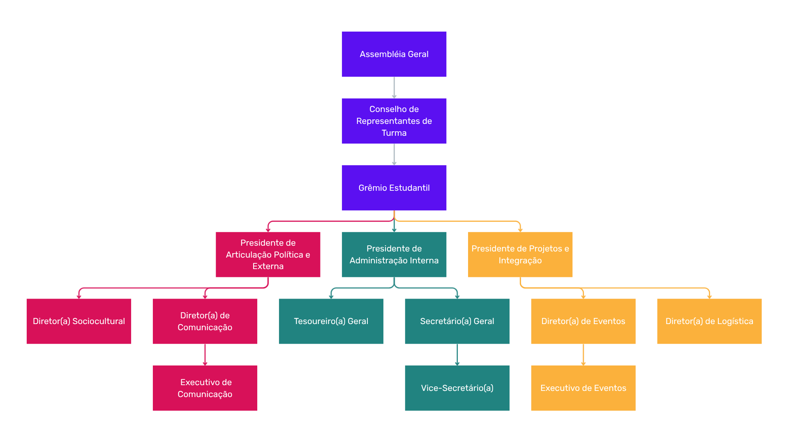
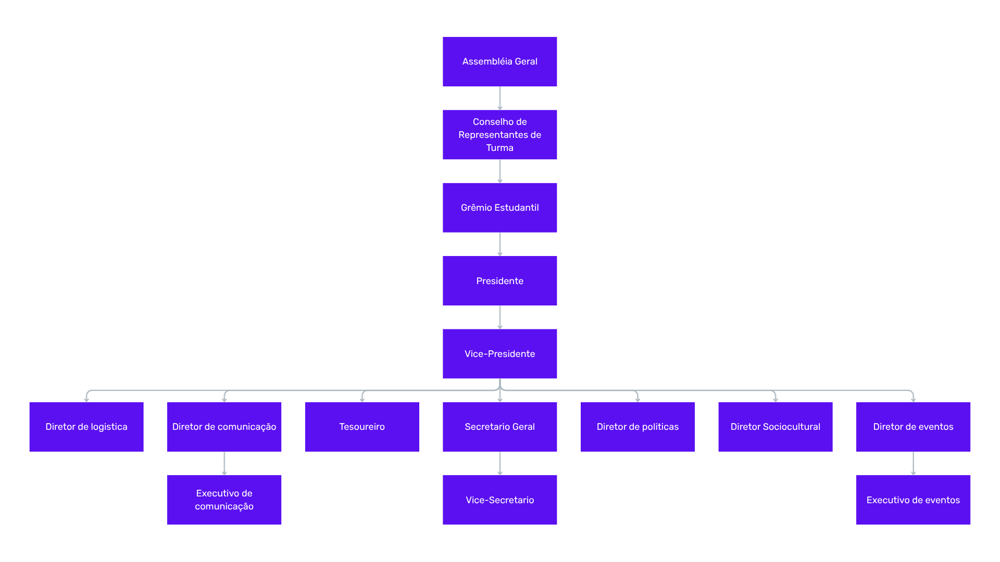

# 1. Identificação da Associação

## Denominação social

- Grêmio Estudantil do IFRS — Campus Farroupilha

### Sigla

- GEIFRSFAR

## Sede (endereço completo)

- Rua São Vicente, 785 — Bairro Cinquentenário, Farroupilha — RS
CEP 95174-274 (IFRS Farroupilha)
- Coordenadas: -29.20239242535538, -51.3482184571569
- Local: sala da entidade no campus (se houver)

## Prazo de duração

- Indeterminado

## Natureza jurídica

- Associação civil sem fins lucrativos (poderá ter CNPJ)

## Identidade visual (a definir pela chapa eleita)

- Cores oficiais
- Logomarca e símbolos
- Bandeira
- Hino ou lema

# 2. Finalidades e objetivos

## Objetivo principal

- Representar os alunos dos cursos do ensino médio integrado e técnico.

## Filiação

- É permitida a filiação a outras entidades.

## Fins lucrativos

- Vedada a distribuição de lucros e dividendos.

# 3. Categorias e admissão de associados

## Categorias

- Associado efetivo: todos os alunos com matrícula ativa nos cursos do ensino médio integrado e técnico.
- Associado colaborador/contribuinte: associados efetivos que contribuíram para a criação de patrimônio ou doação de bens (conforme cláusulas sobre bens).
- Associado honorário (da direção): convocado como voluntário temporário para auxílio da direção (pode ocupar cargos de apoio conforme regulamento).

## Requisitos e documentação para a direção

- Requisitos: estar matriculado (médio integrado ou técnico) e não ter pendência em mais de duas matérias.
- Documentação: atestado de matrícula.

## Processo de solicitação e aprovação

- Via convocação da direção atual (apenas nos casos de vacância previstos).
- Via inscrição de chapas em processos eleitorais.
- Aprovação: pela diretoria (maioria simples — 50% + 1).
- Prazo de análise: 3 dias úteis.

# 4. Direitos dos associados

- Votar em assembleias (ser associado).
- Ser eleito para cargos, observados os requisitos previstos.
- Solicitar convocação de assembleia (voto de pelo menos 1/5 dos associados).
- Acessar livros fiscais e atas (conforme regras internas).
- Frequentar dependências da sede (conforme normas).
- Apresentar sugestões e reclamações.

# 5. Deveres dos associados

- Cumprir o estatuto e o regimento interno.
- Comparecer às assembleias quando convocado.
- Zelar pelo patrimônio da associação e da instituição parceira.
- Manter conduta ética e decoro.
- Não falar em nome da entidade sem autorização.

# 6. Infrações e penalidades

## Infrações

- Descumprimento do estatuto (sujeita a advertências).
- Conduta indecorosa ou nociva (poderá ensejar procedimento para saída).

## Penalidades

- Advertência (verbal e/ou escrita).
- Suspensão (prazo e motivos definidos em regulamento).
- Exclusão por justa causa.

# 7. Assembleia Geral

## Natureza

Órgão soberano da entidade.

## Tipos e periodicidade

- Assembleia Geral Ordinária (AGO): início e final do ano letivo.
- Assembleia Geral Extraordinária (AGE): convocada com antecedência mínima de 15 dias.

## Competências privativas

- Destituir administradores.
- Alterar o estatuto.
- Aprovar as contas anuais.
- Eleger diretoria e conselhos provisórios quando necessário.

## Convocação e publicidade

- Edital com prazo mínimo de 3 dias úteis, salvo disposição em contrário.
- Publicidade por e-mail, jornal, mural ou outros meios previstos.

## Pauta e participação

- Deve constar no edital os tópicos da pauta e os convidados.

## Intervalo entre chamadas

- Intervalo mínimo de 30 dias letivos entre convocações sucessivas para o mesmo assunto, salvo exigência legal diversa.

## Quóruns e votação

- Quórum simples para matérias gerais: maioria (50% + 1 dos presentes ou dos associados, conforme o caso).
- Quórum qualificado para alteração do estatuto, destituição e dissolução: 60%.
- Votação: em regra, voto secreto para matérias eleitorais e outras previstas.
- Desempate: decisão da presidência da mesa, composta pelos presidentes e número igual de associados designados.

## Mesa diretora e secretariado

- Definição da mesa, secretariado e responsabilidade pela lavratura das atas.

## Livros obrigatórios

- Livro de atas
- Livro de presença
- Livro caixa (avaliar necessidade de outros registros)

# 8. Diretoria Executiva

## Estrutura e mandato

- Mandato: 2 anos.
- Reeleição: permitida.
- Posse: 01/01 do ano subsequente à eleição.
- Estrutura: a escolha de cada chapa, com base em uma das opções abaixo:

    1) Modelo de conselho de presidência (HORIZONTAL VERTICALIZADO por áreas)
    
    

    2) Modelo verticalizado (ENGESSADO por hierarquias)

    
## Remuneração

- Exercício gratuito (trabalho voluntário), salvo reembolso de despesas autorizadas.

## Perda de mandato, renúncia e vacância

- Regras previstas em anexo ou regulamento específico (a elaborar).

## Gestão financeira

- Assinatura e movimentação bancária: regras de operação (conjunta/solidária) a definir.
- Responsabilidade pela arrecadação e prestação de contas.
- Balancetes mensais e relatório anual de atividades.

# 9. Conselho Fiscal

- Composição, competências e periodicidade das reuniões serão definidas juntamente com a estrutura dos cargos (regulamento).

# 10. Processo eleitoral

- Regras do processo eleitoral a serem definidas em regulamento específico.

# 11. Patrimônio e recursos financeiros

## Constituição do patrimônio social

1) Bens materiais (tangíveis)

- Mobiliário: mesas, cadeiras, armários, quadros/lousas.
- Eletrônicos: computadores, equipamentos de som, projetores, cabos.
- Atividades de lazer/esporte: mesas de jogos, bolas, redes, jogos de tabuleiro, videogames.
- Equipamentos para eventos/cozinha: máquina de pipoca/algodão doce, eletrodomésticos, utensílios, bandeiras e decoração.

2) Recursos financeiros

- Dinheiro em caixa (fundo de troco).
- Saldo bancário.
- Aplicações financeiras.
- Contas a receber.

3) Bens documentais (arquivo morto)

- Livros (atas, livro caixa).
- Estatuto social.
- Documentos legais (CNPJ, ofícios).
- Acervo histórico (fotos, troféus).

4) Bens imateriais (intangíveis)

- Marca e identidade visual.
- Acessos digitais (contas e senhas das redes sociais pertencentes ao Grêmio).
- Projetos em andamento.

## Gestão patrimonial

- Fontes de receita: doações, legados, eventos, convênios.
- Alienação ou oneração de bens: exige quórum qualificado.
- Itens a definir em regulamento: fundo de reserva, normas contábeis, publicidade das contas, aceitação de doações com encargos.

# 12. Gestão de pessoas e operações

- Regras para trabalho voluntário (termo de adesão a ser estabelecido).
- Reembolso de despesas mediante apresentação de comprovantes e aprovação.
- Proibição do uso do nome da associação para fins pessoais.
- Perda de mandato por faltas injustificadas: critérios a definir.

# 13. Dissolução da associação

- Causas e procedimento de dissolução a estabelecer.
- Quórum específico para deliberação.
- Nomeação de liquidante e pagamento de passivos.
- Destino do patrimônio: entidade congênere ou, residualmente, à Fazenda Pública.
- Casos omissos: regidos pelo Código Civil.

# 14. Disposições gerais e transitórias

- Possibilidade de criação de regimento interno (definir órgão aprovador).
- Criação de departamentos ou filiais temporárias.
- Uso da marca por terceiros: regras a definir.
- Representação judicial e extrajudicial.

- Vigência do estatuto: 5 anos, com necessidade de revisão ao final do período.
