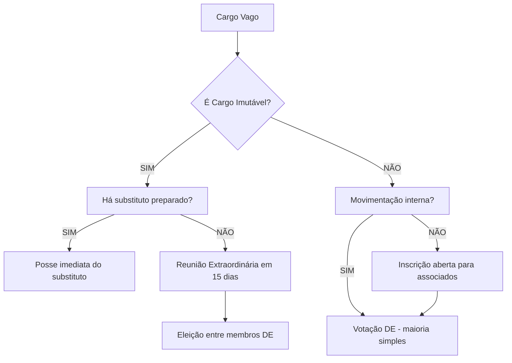

# 📋 README - Plano de Reforma Estatutária do Grêmio Estudantil IFRS Campus Farroupilha

## 📌 INFORMAÇÕES GERAIS

### Contexto do Projeto
- **Entidade:** Grêmio Estudantil IFRS Campus Farroupilha (GEIFRSFAR)
- **Estatuto Vigente:** Aprovado em 20/10/2025, em vigor desde 21/10/2025
- **Objetivo da Reforma:** Modernização estrutural, ampliação da transparência financeira e profissionalização da gestão
- **Base Legal:** Lei Federal nº 7.398/85 (Lei do Grêmio Estudantil)
- **Documentos Base:**
  - Estatuto Atual (56 artigos)
  - Documento de Estrutura do Grêmio (reforma proposta)

---

## 📊 ESTRUTURA DO DOCUMENTO

### Seções Principais:
1. [Visão Geral das Mudanças](#-visão-geral-das-mudanças)
2. [Alterações Detalhadas por Título](#-alterações-detalhadas-por-título)
3. [Adições Completamente Novas](#-adições-completamente-novas)
4. [Tabelas de Comparação Artigo por Artigo](#-tabelas-de-comparação-artigo-por-artigo)
5. [Impactos Operacionais](#-impactos-operacionais)
6. [Cronograma de Implementação](#-cronograma-de-implementação)
7. [Documentos Complementares Necessários](#-documentos-complementares-necessários)
8. [Glossário de Termos](#-glossário-de-termos)

---

## 🔍 VISÃO GERAL DAS MUDANÇAS

### Estatísticas da Reforma

| Métrica | Valor | Observação |
|---------|-------|------------|
| **Artigos no Estatuto Atual** | 56 | Base aprovada em 2025 |
| **Artigos Mantidos Integralmente** | 17 | ~30% preservados |
| **Artigos Alterados/Expandidos** | 26 | ~46% reformados |
| **Artigos/Seções Completamente Novas** | 15 | ~27% de inovação |
| **Novos Órgãos Criados** | 1 | GFA (Grupo de Fiscalização e Auditoria) |
| **Novos Documentos Obrigatórios** | 3 | Regimento Interno, Anexo 2, Termo de Adesão |
| **Prazo de Vigência do Estatuto** | 5 anos | vs. indefinido no atual |

### Áreas de Impacto Principal

```
🏛️ GOVERNANÇA (40% das mudanças)
├── Flexibilização de modelos de gestão
├── Hierarquias definidas em 3 níveis
├── Criação de cargos subordinados sem voto
└── Regime de vacância e substituição detalhado

💰 GESTÃO FINANCEIRA (30% das mudanças)
├── Criação do GFA
├── Fundo de Reserva obrigatório (20% do lucro)
├── Homologação de contas com membro externo
└── Normas contábeis padronizadas (Anexo 2)

👥 PARTICIPAÇÃO ESTUDANTIL (20% das mudanças)
├── Prazo de convocação ampliado (15 dias)
├── Inclusão de pautas pelos associados
├── AG Parte 2 (continuação em 48h)
└── Quórum de urgência detalhado

⚖️ REGIME DISCIPLINAR (10% das mudanças)
├── Sistema progressivo de penalidades
├── Inatividade como critério objetivo
└── Convite para Saída formalizado
```

---

## 📖 ALTERAÇÕES DETALHADAS POR TÍTULO

### TÍTULO I - DA DENOMINAÇÃO, SEDE E OBJETIVOS

#### ✅ Artigos Mantidos
- **Art. 1º**: Denominação e natureza jurídica (mantido integralmente)
- **Art. 2º**: Localização da sede (mantido integralmente)
- **Art. 4º**: Objetivos do Grêmio (mantido integralmente)

#### 🔄 Artigos Alterados
**Art. 3º - Identidade Visual**
- **ATUAL**: Uso do nome da chapa como regra geral
- **REFORMA**: Mantém uso da identidade da chapa, mas ADICIONA obrigatoriedade de usar "Grêmio Estudantil IFRS - Campus Farroupilha" em documentos oficiais

```diff
+ Parágrafo Único: O uso da denominação formal será OBRIGATÓRIO para:
+   I. Atos jurídicos e contratos
+   II. Documentos financeiros e prestação de contas
+   III. Ofícios e requerimentos institucionais
```

**📌 JUSTIFICATIVA:** Garante conformidade legal em documentação oficial sem limitar a comunicação informal da chapa.

---

### TÍTULO II - DO PATRIMÔNIO E DA GESTÃO FINANCEIRA

#### 🆕 PRINCIPAL MUDANÇA: Criação do GFA (Grupo de Fiscalização e Auditoria)

**O QUE MUDA:**

| Aspecto | Estatuto Atual (Art. 8) | Plano de Reforma (Seção 9) |
|---------|-------------------------|----------------------------|
| **Órgão Fiscalizador** | "Não é obrigatório Conselho Fiscal" | **GFA obrigatório** |
| **Composição** | Não definido | 4 membros: Presidente, Diretor de Finanças, Membro Externo, Responsável CNPJ |
| **Frequência de Fiscalização** | Anual (AG final) | **Contínua** (mensal) |
| **Assinatura de Relatórios** | Diretor de Finanças + Sec. Geral | **Diretor de Finanças + Membro Externo + 1** (obrigatório) |
| **Transparência** | Publicação mensal (Art. 8, §2º) | Mantém + Homologação pelo GFA |

**📐 ESTRUTURA DO GFA:**
y
```
GFA (Grupo de Fiscalização e Auditoria)
├── Todos os cargos de Presidência (membro interno)
├── Diretor de Finanças (membro interno)
├── Membro da Comunidade Externa (OBRIGATÓRIO - auditor externo)
└── Responsável pelo CNPJ (se houver)

FUNÇÃO: Homologar contas mensais + aprovar alienação de bens
PODER: Vetar investimentos > 5 salários-mínimos
```

#### 🆕 FUNDO DE RESERVA

**Art. 11.1 (NOVO):**
```
20% do lucro (total arrecadado - total gasto) deve ser 
destinado ao Fundo de Reserva.

EXEMPLO PRÁTICO:
Arrecadação: R$ 10.000
Gastos: R$ 7.000
Lucro: R$ 3.000
Fundo de Reserva: R$ 600 (20% de R$ 3.000)
Livre para uso: R$ 2.400
```

**📌 JUSTIFICATIVA:** Garante sustentabilidade financeira e proteção contra crises.

#### 🆕 NORMAS CONTÁBEIS PADRONIZADAS

**Art. 11.2 (NOVO):**
- Cria o **Anexo 2 - Regulamento de Normas Contábeis**
- Define fluxos de aprovação, registro e auditoria
- Padroniza classificação de receitas e despesas

#### 🔄 ALIENAÇÃO DE BENS

**Art. 11.3 (NOVO):**
- DE pode aprovar alienação de bens até **5 salários-mínimos**
- Acima disso, requer aprovação da GFA
- Homologação obrigatória antes da efetivação

---

### TÍTULO III - DA ORGANIZAÇÃO E ESTRUTURA

#### 🆕 MODELOS ORGANIZACIONAIS DA DIRETORIA

**MAIOR INOVAÇÃO: Flexibilidade Estrutural**

**Art. 8.2 (NOVO):**

##### MODELO 1: VERTICALIZADO (Hierárquico)


##### MODELO 2: CONSELHO (Horizontal)


**📌 REGRAS:**
1. A chapa DEVE declarar o modelo escolhido no **Plano de Gestão**
2. Modelo Conselho exige **mínimo 2 cargos de Presidência no mesmo nível**
3. Modelo escolhido NÃO pode ser alterado durante o mandato

#### 🆕 CARGOS SUBORDINADOS (NÍVEL 3)

**Art. 8.4 (NOVO):**

| Característica | Detalhamento |
|----------------|--------------|
| **Classificação** | Associados Dirigente |
| **Voto na DE** | Possuem |
| **Formalização** | ✅ Termo de Adesão obrigatório |
| **Exemplos** | Vice-Secretário, Assessor de Com., Coord. de Projetos |

---

#### 🔄 ASSEMBLEIA GERAL (AG)

**MUDANÇAS PRINCIPAIS:**

| Aspecto | Atual | Reforma | Impacto |
|---------|-------|---------|---------|
| **Convocação** | Sem prazo definido | **15 dias de antecedência** | +Mobilização |
| **Inclusão de Pautas** | ❌ Não previsto | **✅ Até 3 dias úteis antes** | +Democracia |
| **Quórum de Urgência** | Art. 13, §2º (voto unânime) | **Aviso Prévio em Edital sobre tom de Urgência** | +Clareza |
| **Continuação (Parte 2)** | ❌ Não previsto | **✅ Em até 48h (online/presencial)** | +Praticidade |
| **Quórum Qualificado** | 2/3 para destituição | **✅ Mantido e formalizado** | Estabilidade |

**📐 EXEMPLO DE FLUXO DA AG COM CONTINUAÇÃO:**

```
AG PARTE 1 (Presencial - Dia 1)
├── Pauta 1: Aprovação de Contas ✅
├── Pauta 2: Reforma Estatutária ✅
├── Pauta 3: Destituição (polêmica)
│   └── Tempo esgotado → Adiamento
│
AG PARTE 2 (Online - Até 48h depois)
└── Pauta 3: Destituição
    ├── Debate online
    ├── Votação
    └── Decisão final ✅
```

---

#### 🔄 DIRETORIA EXECUTIVA

**Art. 15 - Composição (MANTIDO com DETALHAMENTO):**
```
CARGOS OBRIGATÓRIOS (10):
1. Cargos de Presidência (Contam como Cargos opcionais se escolhido horizontalizado, tem que totalizar no maximo 10 integrantes)
2. (Se verticaliazado Vice-Presidente é obrigatório)
3. Diretor de Secretáriado Geral
4. Assesor de Secretáriado Geral
5. Diretor de Finanças
6. Diretor de Comunicação
7. Diretor de Eventos
8. Diretor Sociocultural
9. Diretor de Políticas
10. Diretor de Logística

11. [Cargo opcional]
12. [Cargo opcional]
13. [Cargo opcional]
14. [Cargo opcional]
```


**⚠️ IMPORTANTE:** Os 4 cargos opcionais devem ter competências descritas no Plano de Gestão.

---

#### 🆕 VACÂNCIA DE CARGOS (REGRAS DETALHADAS)

**Art. 28 (REFORMADO) + Art. 27-A (NOVO):**

##### CARGOS IMUTÁVEIS (Presidente, Vice, Diretor de Finanças):

```
REGRAS DE SUBSTITUIÇÃO:
1. Substituto DEVE ser da Diretoria atual
2. Aprovação por MAIORIA SIMPLES da DE
3. Cálculo: (total DE / 2) arredondado para baixo + 1

EXEMPLO: DE com 10 membros
Maioria simples = (10/2) + 1 = 6 votos

VACÂNCIA PERMITIDA APENAS POR:
- Destituição (AG)
- Votação interna (maioria absoluta DE)
- Desistência formal
```

##### DEMAIS CARGOS:

```
ORDEM DE PREENCHIMENTO:
1º) Movimentação interna (outro diretor assume)
2º) Preparação de associado externo
3º) Votação da DE (maioria simples)
```

##### PRAZOS DE TRANSIÇÃO:

| Tipo de Saída | Prazo de Preparação | Prazo de Conclusão |
|---------------|---------------------|-------------------|
| **Saída Programada** (ex: formatura) | 4 semanas antes | 2 semanas antes |
| **Inatividade/Desistência** | 2 semanas | 1 semana antes |

**📐 FLUXO DE VACÂNCIA:**



---

### TÍTULO IV - DOS ASSOCIADOS

#### 🆕 CATEGORIAS DE ASSOCIADOS (NOVA ESTRUTURA)

**Art. 3.1 a 3.4 (NOVO):**

| Categoria | Descrição | Direitos | Deveres |
|-----------|-----------|----------|---------|
| **Associado Efetivo** | Estudante matriculado | Voz + Voto + Ser votado | Cumprir Estatuto |
| **Associado Dirigente** | Efetivo com cargo na DE/CRT | Efetivo + Gestão | Efetivo + Responsabilidades |
| **Associado Apoiador** | Voluntário em tarefas específicas | ❌ SEM voto na DE | Termo de Adesão |
| **Associado Honorário** | Homenageado (não-estudante) | ❌ SEM participação deliberativa | Nenhum |

**📌 FLUXO DE CATEGORIZAÇÃO:**

```
Estudante Matriculado
    ↓
[Associado Efetivo]
    ↓
    ├─→ Eleito para DE/CRT? → [Associado Dirigente]
    ├─→ Voluntário em projeto? → [Associado Apoiador]
    └─→ Desassocia-se? → [Não-Associado]
```

#### 🔄 REQUISITOS PARA DIREÇÃO

**Art. 3.5 (NOVO):**

```
CRITÉRIOS DE ELEGIBILIDADE:
✅ Ser Associado Efetivo
✅ Não ter penalidade disciplinar grave (últimos 12 meses)
✅ Não estar em dependência em >2 disciplinas

PENALIDADE GRAVE INCLUI:
- Suspensão cumprida
- Exclusão anterior
- Advertência por ato gravíssimo
```

---

### TÍTULO VI - DO MANDATO E REGIME DISCIPLINAR

#### 🆕 REGIME PROGRESSIVO DE PENALIDADES

**Art. 6.1 a 6.3 (NOVO):**

##### SISTEMA DE INFRAÇÕES:

```
INFRAÇÕES LEVES (Exemplos):
- Atraso em reunião (< 15 min)
- Não responder comunicação oficial (< 48h)
- Uso inadequado de material do Grêmio

INFRAÇÕES MÉDIAS (Exemplos):
- Falta injustificada a reunião ordinária
- Não cumprir prazo de entrega de relatório
- Conflito de interesse não declarado

INFRAÇÕES GRAVES (Exemplos):
- Desvio de recursos financeiros
- Uso da marca para fins pessoais lucrativos
- Assédio moral/discriminação
```

##### PROGRESSÃO DE PENALIDADES:

```
1️⃣ 5 INFRAÇÕES LEVES
    ↓
2️⃣ ADVERTÊNCIA (formal, por escrito)
    ↓ (se reincidência)
3️⃣ SUSPENSÃO (perda temporária de direitos)
    ↓ (se novo ato grave)
4️⃣ EXCLUSÃO (perda do cargo na DE/CRT)

ATALHO: Ato GRAVÍSSIMO → EXCLUSÃO IMEDIATA
```

**📐 EXEMPLO PRÁTICO:**

```
Mês 1: João (Diretor) falta reunião → Infração Média (1)
Mês 2: João atrasa 20 min → Infração Leve (1)
Mês 3: João não entrega relatório → Infração Média (2)
Mês 4: João acumula 5 leves + 2 médias → ADVERTÊNCIA
Mês 5: João falta nova reunião → SUSPENSÃO (reincidência)
Mês 6: João desvia R$ 500 → EXCLUSÃO (ato gravíssimo)
```

#### 🆕 INATIVIDADE COMO CRITÉRIO DE SAÍDA

**Art. 6.3 + 49-A (NOVO):**

```
CRITÉRIOS DE INATIVIDADE:
❌ 3 faltas consecutivas (reuniões ordinárias)
❌ 5 faltas intercaladas (reuniões ordinárias)
❌ 30 dias sem realizar nenhuma atividade

PROCESSO DE CONVITE PARA SAÍDA:
1. Presidente notifica por escrito
2. Membro tem 7 dias para justificar
3. Sem justificativa válida → Reunião Extraordinária DE
4. Votação: Maioria Simples → Saída aprovada
```

**⚠️ EXCEÇÃO:** Se o inativo for o Presidente, a convocação é feita pela maioria da DE.

---

## 🆕 ADIÇÕES COMPLETAMENTE NOVAS

### 2. REGIMENTO INTERNO

**Art. 14.3 (NOVO):**

**Conteúdo Mínimo Exigido:**
```
REGIMENTO INTERNO DO GRÊMIO ESTUDANTIL
├── 1. Procedimentos Operacionais
│   ├── Convocação de reuniões
│   ├── Fluxo de aprovação de projetos
│   └── Comunicação oficial
├── 2. Normas de Uso da Sede
├── 3. Política de Eventos
├── 4. Fluxo de Reembolsos
└── 5. Protocolo de Conflitos
```

**📌 APROVAÇÃO:** Maioria simples da DE + publicação no site oficial.

---

### 3. ANEXO 2 - REGULAMENTO DE NORMAS CONTÁBEIS

**Art. 11.2 (NOVO):**

**Estrutura do Anexo:**
```
ANEXO 2 - NORMAS CONTÁBEIS
├── 1. Classificação de Receitas
│   ├── Doações
│   ├── Eventos
│   ├── Comercialização de produtos
│   └── Outras
├── 2. Classificação de Despesas
│   ├── Eventos
│   ├── Material de escritório
│   ├── Infraestrutura
│   └── Reembolsos
├── 3. Fluxo de Aprovação
│   ├── Gastos até R$ 500 → Diretor de Finanças
│   ├── R$ 500 a 5 SM → Diretor de Finanças + GFA
│   └── Acima de 5 SM → DE completa
└── 4. Relatórios Obrigatórios
    ├── Balancete mensal
    ├── DRE semestral
    └── Prestação de contas anual
```

---

### 4. VIGÊNCIA DO ESTATUTO (5 ANOS)

**Art. 14.1 (NOVO):**

```
LINHA DO TEMPO:
2025 ────────────────────── 2030
 │                            │
 └─ Aprovação (21/10/2025)   └─ REVISÃO OBRIGATÓRIA
 
AO FINAL DE 5 ANOS:
1. Diretoria DEVE convocar Comissão de Revisão
2. Comissão elabora proposta de atualização
3. AG Extraordinária aprova nova versão
4. Novo ciclo de 5 anos inicia
```

**📌 JUSTIFICATIVA:** Impede obsolescência do Estatuto e força adaptação às mudanças do Campus.

---

### 5. DISSOLUÇÃO E DESTINO DE BENS

**Art. 13.1 e 13.2 (NOVO):**

```
CAUSAS DE DISSOLUÇÃO:
1. Extinção do IFRS Campus Farroupilha
2. Deliberação da AG (maioria absoluta)

DESTINO DO PATRIMÔNIO:
Bens Remanescentes → Entidades Estudantis do IFRS
    ├── Preferência: Grêmios de outros Campi
    ├── Alternativa: DCE do IFRS (se existir)
    └── Última opção: UNE/UBES

VEDADO:
❌ Distribuir bens entre membros da gestão
❌ Doar para entidades não-estudantis
❌ Vender patrimônio antes da dissolução
```

---

## 📊 TABELAS DE COMPARAÇÃO ARTIGO POR ARTIGO
t
### TÍTULO I - DENOMINAÇÃO, SEDE E OBJETIVOS

| Artigo | Estatuto Atual | Plano de Reforma | Status |
|--------|----------------|------------------|--------|
| Art. 1º | Denominação e natureza | ✅ Mantido | 🟢 SEM MUDANÇA |
| Art. 2º | Sede no Campus | ✅ Mantido | 🟢 SEM MUDANÇA |
| Art. 3º | Identidade visual | 🔄 Nome da chapa | 🟡 DETALHADO (+ uso formal) |
| Art. 4º | 7 objetivos listados | ✅ Mantido | 🟢 SEM MUDANÇA |

### TÍTULO II - PATRIMÔNIO E GESTÃO FINANCEIRA

| Artigo | Estatuto Atual | Plano de Reforma | Status |
|--------|----------------|------------------|--------|
| Art. 5º | Constituição do patrimônio | 🔄 3 itens genéricos | 🟡 DETALHADO (+ marcas, direitos) |
| Art. 6º | Receitas | ✅ 4 fontes | 🟢 SEM MUDANÇA |
| Art. 7º | Gestão do Diretor de Finanças | ✅ Mantido | 🟢 SEM MUDANÇA |
| Art. 8º | Transparência (sem Conselho Fiscal) | 🆕 Cria GFA | 🔴 SUBSTITUÍDO |
| Art. 9º | Dissolução | 🔄 Bens para entidades congêneres | 🟡 DETALHADO (+ IFRS) |
| — | — | 🆕 Art. 11.1: Fundo de Reserva | 🔴 NOVO |
| — | — | 🆕 Art. 11.2: Normas Contábeis | 🔴 NOVO |
| — | — | 🆕 Art. 11.3: Alienação de Bens | 🔴 NOVO |

### TÍTULO III - ORGANIZAÇÃO E ESTRUTURA

| Artigo | Estatuto Atual | Plano de Reforma | Status |
|--------|----------------|------------------|--------|
| Art. 11 | AG é órgão soberano | ✅ Mantido | 🟢 SEM MUDANÇA |
| Art. 12 | Competências da AG | ✅ 5 itens | 🟢 SEM MUDANÇA |
| Art. 13 | Convocação da AG | 🔄 Sem prazo definido | 🟡 ALTERADO (15 dias) |
| — | Art. 13, §2º: Urgência | 🔄 Voto unânime | 🟡 DETALHADO (+ maioria DE) |
| — | — | 🆕 Inclusão de pautas (3 dias úteis) | 🔴 NOVO |
| — | — | 🆕 AG Parte 2 (48h) | 🔴 NOVO |
| Art. 14 | DE é órgão executivo | ✅ Mantido | 🟢 SEM MUDANÇA |
| Art. 15 | 8-10 cargos | 🔴 NOVO | 🟡 ALTERADO de 10-14 Integrantes/cargos |
| — | — | 🆕 Modelos Verticalizado/Conselho | 🔴 NOVO |
| — | — | 🆕 Hierarquia 3 níveis | 🔴 NOVO |
| — | — | 🆕 Cargos subordinados (sem voto) | 🔴 NOVO |
| Art. 17-24 | Competências específicas | ✅ Mantidos | 🟢 SEM MUDANÇA |
| Art. 25 | Reuniões da DE | ✅ Mensal | 🟢 SEM MUDANÇA |
| Art. 27 | Hierarquias | 🔄 Genérico | 🟡 DETALHADO (3 níveis) |
| Art. 28 | Vacância | 🔄 Regras básicas | 🟡 DETALHADO (+ prazos) |
| — | — | 🆕 Art. 27-A: Preparação de substituto | 🔴 NOVO |

### TÍTULO IV - DOS ASSOCIADOS

| Artigo | Estatuto Atual | Plano de Reforma | Status |
|--------|----------------|------------------|--------|
| Art. 33 | Associados = matriculados | ✅ Mantido | 🟢 SEM MUDANÇA |
| Art. 34 | Direitos | ✅ 4 itens | 🟢 SEM MUDANÇA |
| Art. 35 | Limitações de não-associados | ✅ Mantido | 🟢 SEM MUDANÇA |
| Art. 36 | Deveres | ✅ Mantido | 🟢 SEM MUDANÇA |
| Art. 37 | Penalidades genéricas | 🔄 3 tipos | 🟡 REGIME PROGRESSIVO |
| — | — | 🆕 Categorias de Associados (4) | 🔴 NOVO |
| — | — | 🆕 Requisitos para Direção | 🔴 NOVO |

### TÍTULO V - DO PROCESSO ELEITORAL

| Artigo | Estatuto Atual | Plano de Reforma | Status |
|--------|----------------|------------------|--------|
| Art. 38-47 | Processo eleitoral | ✅ Mantido | 🟢 SEM MUDANÇA |

### TÍTULO VI - DO MANDATO E REGIME DISCIPLINAR

| Artigo | Estatuto Atual | Plano de Reforma | Status |
|--------|----------------|------------------|--------|
| Art. 48 | Mandato de 2 anos | ✅ Mantido | 🟢 SEM MUDANÇA |
| Art. 49 | Destituição | ✅ 2/3 da AG | 🟢 SEM MUDANÇA |
| — | — | 🆕 Art. 49-A: Convite para Saída | 🔴 NOVO |
| — | — | 🆕 Art. 49-B: Prazos de Transição | 🔴 NOVO |
| — | — | 🆕 Regime Progressivo (5 leves → Advertência) | 🔴 NOVO |

### TÍTULO VII - DISPOSIÇÕES FINAIS

| Artigo | Estatuto Atual | Plano de Reforma | Status |
|--------|----------------|------------------|--------|
| Art. 50-56 | Disposições finais | ✅ Mantidos | 🟢 SEM MUDANÇA |
| — | — | 🆕 Vigência de 5 anos | 🔴 NOVO |
| — | — | 🆕 Revisão obrigatória | 🔴 NOVO |
| — | — | 🆕 Regimento Interno | 🔴 NOVO |

---

#
**Versão:** 1.0  
**Data de Criação:** Novembro/2025  
**Última Atualização:** Novembro/2025  
**Próxima Revisão:** Após implementação completa (estimada para Agosto/2026)


**🎯 OBJETIVO ALCANÇADO:** ✅ Documentação completa para transferência de conhecimento sobre o Plano de Reforma Estatutária.