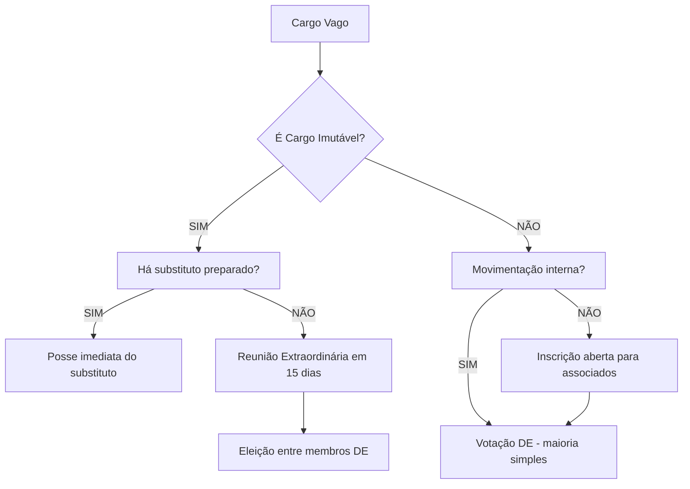

# 📋 README - Plano de Reforma Estatutária do Grêmio Estudantil IFRS Campus Farroupilha

## 📌 INFORMAÇÕES GERAIS

### Contexto do Projeto
- **Entidade:** Grêmio Estudantil IFRS Campus Farroupilha (GEIFRSFAR)
- **Estatuto Vigente:** Aprovado em 20/10/2025, em vigor desde 21/10/2025
- **Objetivo da Reforma:** Modernização estrutural, ampliação da transparência financeira e profissionalização da gestão
- **Base Legal:** Lei Federal nº 7.398/85 (Lei do Grêmio Estudantil)
- **Documentos Base:**
  - Estatuto Atual (56 artigos)
  - Documento de Estrutura do Grêmio (reforma proposta)

---

## 🎯 OBJETIVO DESTA DOCUMENTAÇÃO

Este README serve como **guia completo de instrução** para transferir o conhecimento sobre o Plano de Reforma Estatutária para outra IA ou equipe técnica. Contém:

1. ✅ Todas as alterações propostas (artigo por artigo)
2. ✅ Justificativas técnicas e legais
3. ✅ Impactos práticos de cada mudança
4. ✅ Estrutura de implementação
5. ✅ Referências cruzadas entre Estatuto Atual e Reforma

---

## 📊 ESTRUTURA DO DOCUMENTO

### Seções Principais:
1. [Visão Geral das Mudanças](#-visão-geral-das-mudanças)
2. [Alterações Detalhadas por Título](#-alterações-detalhadas-por-título)
3. [Adições Completamente Novas](#-adições-completamente-novas)
4. [Tabelas de Comparação Artigo por Artigo](#-tabelas-de-comparação-artigo-por-artigo)
5. [Impactos Operacionais](#-impactos-operacionais)
6. [Cronograma de Implementação](#-cronograma-de-implementação)
7. [Documentos Complementares Necessários](#-documentos-complementares-necessários)
8. [Glossário de Termos](#-glossário-de-termos)

---

## 🔍 VISÃO GERAL DAS MUDANÇAS

### Estatísticas da Reforma

| Métrica | Valor | Observação |
|---------|-------|------------|
| **Artigos no Estatuto Atual** | 56 | Base aprovada em 2025 |
| **Artigos Mantidos Integralmente** | 17 | ~30% preservados |
| **Artigos Alterados/Expandidos** | 26 | ~46% reformados |
| **Artigos/Seções Completamente Novas** | 15 | ~27% de inovação |
| **Novos Órgãos Criados** | 1 | GFA (Grupo de Fiscalização e Auditoria) |
| **Novos Documentos Obrigatórios** | 3 | Regimento Interno, Anexo 2, Termo de Adesão |
| **Prazo de Vigência do Estatuto** | 5 anos | vs. indefinido no atual |

### Áreas de Impacto Principal

```
🏛️ GOVERNANÇA (40% das mudanças)
├── Flexibilização de modelos de gestão
├── Hierarquias definidas em 3 níveis
├── Criação de cargos subordinados sem voto
└── Regime de vacância e substituição detalhado

💰 GESTÃO FINANCEIRA (30% das mudanças)
├── Criação do GFA
├── Fundo de Reserva obrigatório (20% do lucro)
├── Homologação de contas com membro externo
└── Normas contábeis padronizadas (Anexo 2)

👥 PARTICIPAÇÃO ESTUDANTIL (20% das mudanças)
├── Prazo de convocação ampliado (15 dias)
├── Inclusão de pautas pelos associados
├── AG Parte 2 (continuação em 48h)
└── Quórum de urgência detalhado

⚖️ REGIME DISCIPLINAR (10% das mudanças)
├── Sistema progressivo de penalidades
├── Inatividade como critério objetivo
└── Convite para Saída formalizado
```

---

## 📖 ALTERAÇÕES DETALHADAS POR TÍTULO

### TÍTULO I - DA DENOMINAÇÃO, SEDE E OBJETIVOS

#### ✅ Artigos Mantidos
- **Art. 1º**: Denominação e natureza jurídica (mantido integralmente)
- **Art. 2º**: Localização da sede (mantido integralmente)
- **Art. 4º**: Objetivos do Grêmio (mantido integralmente)

#### 🔄 Artigos Alterados
**Art. 3º - Identidade Visual**
- **ATUAL**: Uso do nome da chapa como regra geral
- **REFORMA**: Mantém uso da identidade da chapa, mas ADICIONA obrigatoriedade de usar "Grêmio Estudantil IFRS - Campus Farroupilha" em documentos oficiais

```diff
+ Parágrafo Único: O uso da denominação formal será OBRIGATÓRIO para:
+   I. Atos jurídicos e contratos
+   II. Documentos financeiros e prestação de contas
+   III. Ofícios e requerimentos institucionais
```

**📌 JUSTIFICATIVA:** Garante conformidade legal em documentação oficial sem limitar a comunicação informal da chapa.

---

### TÍTULO II - DO PATRIMÔNIO E DA GESTÃO FINANCEIRA

#### 🆕 PRINCIPAL MUDANÇA: Criação do GFA (Grupo de Fiscalização e Auditoria)

**O QUE MUDA:**

| Aspecto | Estatuto Atual (Art. 8) | Plano de Reforma (Seção 9) |
|---------|-------------------------|----------------------------|
| **Órgão Fiscalizador** | "Não é obrigatório Conselho Fiscal" | **GFA obrigatório** |
| **Composição** | Não definido | 4 membros: Presidente, Tesoureiro, Membro Externo, Responsável CNPJ |
| **Frequência de Fiscalização** | Anual (AG final) | **Contínua** (mensal) |
| **Assinatura de Relatórios** | Tesoureiro + Sec. Geral | **Tesoureiro + Membro Externo + 1** (obrigatório) |
| **Transparência** | Publicação mensal (Art. 8, §2º) | Mantém + Homologação pelo GFA |

**📐 ESTRUTURA DO GFA:**

```
GFA (Grupo de Fiscalização e Auditoria)
├── Presidência (membro interno)
├── Tesoureiro (membro interno)
├── Membro da Comunidade Externa (OBRIGATÓRIO - auditor externo)
└── Responsável pelo CNPJ (se houver)

FUNÇÃO: Homologar contas mensais + aprovar alienação de bens
PODER: Vetar investimentos > 5 salários-mínimos
```

#### 🆕 FUNDO DE RESERVA

**Art. 11.1 (NOVO):**
```
20% do lucro (total arrecadado - total gasto) deve ser 
destinado ao Fundo de Reserva.

EXEMPLO PRÁTICO:
Arrecadação: R$ 10.000
Gastos: R$ 7.000
Lucro: R$ 3.000
Fundo de Reserva: R$ 600 (20% de R$ 3.000)
Livre para uso: R$ 2.400
```

**📌 JUSTIFICATIVA:** Garante sustentabilidade financeira e proteção contra crises.

#### 🆕 NORMAS CONTÁBEIS PADRONIZADAS

**Art. 11.2 (NOVO):**
- Cria o **Anexo 2 - Regulamento de Normas Contábeis**
- Define fluxos de aprovação, registro e auditoria
- Padroniza classificação de receitas e despesas

#### 🔄 ALIENAÇÃO DE BENS

**Art. 11.3 (NOVO):**
- GFA pode aprovar alienação de bens até **5 salários-mínimos**
- Acima disso, requer aprovação da Diretoria Executiva
- Homologação obrigatória antes da efetivação

---

### TÍTULO III - DA ORGANIZAÇÃO E ESTRUTURA

#### 🆕 MODELOS ORGANIZACIONAIS DA DIRETORIA

**MAIOR INOVAÇÃO: Flexibilidade Estrutural**

**Art. 8.2 (NOVO):**

##### MODELO 1: VERTICALIZADO (Hierárquico)


##### MODELO 2: CONSELHO (Horizontal)


**📌 REGRAS:**
1. A chapa DEVE declarar o modelo escolhido no **Plano de Gestão**
2. Modelo Conselho exige **mínimo 2 cargos de Presidência no mesmo nível**
3. Modelo escolhido NÃO pode ser alterado durante o mandato

#### 🆕 CARGOS SUBORDINADOS (NÍVEL 3)

**Art. 8.4 (NOVO):**

| Característica | Detalhamento |
|----------------|--------------|
| **Classificação** | Associados Apoiadores/Colaboradores |
| **Voto na DE** | ❌ NÃO possuem |
| **Contagem no Limite** | ❌ NÃO contam nos 10 membros votantes |
| **Formalização** | ✅ Termo de Adesão obrigatório |
| **Exemplos** | Vice-Secretário, Assessor de Com., Coord. de Projetos |

**📌 JUSTIFICATIVA:** Resolve conflito de organogramas com >10 pessoas mantendo controle de poder de voto.

---

#### 🔄 ASSEMBLEIA GERAL (AG)

**MUDANÇAS PRINCIPAIS:**

| Aspecto | Atual | Reforma | Impacto |
|---------|-------|---------|---------|
| **Convocação** | Sem prazo definido | **15 dias de antecedência** | +Mobilização |
| **Inclusão de Pautas** | ❌ Não previsto | **✅ Até 3 dias úteis antes** | +Democracia |
| **Quórum de Urgência** | Art. 13, §2º (voto unânime) | **Maioria DE + unânime presentes** | +Clareza |
| **Continuação (Parte 2)** | ❌ Não previsto | **✅ Em até 48h (online/presencial)** | +Praticidade |
| **Quórum Qualificado** | 2/3 para destituição | **✅ Mantido e formalizado** | Estabilidade |

**📐 FLUXO DA AG COM CONTINUAÇÃO:**

```
AG PARTE 1 (Presencial - Dia 1)
├── Pauta 1: Aprovação de Contas ✅
├── Pauta 2: Reforma Estatutária ✅
├── Pauta 3: Destituição (polêmica)
│   └── Tempo esgotado → Adiamento
│
AG PARTE 2 (Online - Até 48h depois)
└── Pauta 3: Destituição
    ├── Debate online
    ├── Votação
    └── Decisão final ✅
```

---

#### 🔄 DIRETORIA EXECUTIVA

**Art. 15 - Composição (MANTIDO com DETALHAMENTO):**

```
CARGOS OBRIGATÓRIOS (8):
1. Presidente
2. Vice-Presidente
3. Secretário Geral
4. Tesoureiro
5. Diretor de Comunicação
6. Diretor de Eventos
7. Diretor Sociocultural
8. Diretor de Políticas

CARGOS OPCIONAIS (até 2):
9. [Nome definido pela chapa]
10. [Nome definido pela chapa]
```

**⚠️ IMPORTANTE:** Os 2 cargos opcionais devem ter competências descritas no Plano de Gestão.

---

#### 🆕 VACÂNCIA DE CARGOS (REGRAS DETALHADAS)

**Art. 28 (REFORMADO) + Art. 27-A (NOVO):**

##### CARGOS IMUTÁVEIS (Presidente, Vice, Tesoureiro):

```
REGRAS DE SUBSTITUIÇÃO:
1. Substituto DEVE ser da Diretoria atual
2. Aprovação por MAIORIA SIMPLES da DE
3. Cálculo: (total DE / 2) arredondado para baixo + 1

EXEMPLO: DE com 10 membros
Maioria simples = (10/2) + 1 = 6 votos

VACÂNCIA PERMITIDA APENAS POR:
- Destituição (AG)
- Votação interna (maioria absoluta DE)
- Desistência formal
```

##### DEMAIS CARGOS:

```
ORDEM DE PREENCHIMENTO:
1º) Movimentação interna (outro diretor assume)
2º) Preparação de associado externo
3º) Votação da DE (maioria simples)
```

##### PRAZOS DE TRANSIÇÃO:

| Tipo de Saída | Prazo de Preparação | Prazo de Conclusão |
|---------------|---------------------|-------------------|
| **Saída Programada** (ex: formatura) | 4 semanas antes | 2 semanas antes |
| **Inatividade/Desistência** | 2 semanas | 1 semana antes |

**📐 FLUXO DE VACÂNCIA:**



---

### TÍTULO IV - DOS ASSOCIADOS

#### 🆕 CATEGORIAS DE ASSOCIADOS (NOVA ESTRUTURA)

**Art. 3.1 a 3.4 (NOVO):**

| Categoria | Descrição | Direitos | Deveres |
|-----------|-----------|----------|---------|
| **Associado Efetivo** | Estudante matriculado | Voz + Voto + Ser votado | Cumprir Estatuto |
| **Associado Dirigente** | Efetivo com cargo na DE/CRT | Efetivo + Gestão | Efetivo + Responsabilidades |
| **Associado Apoiador** | Voluntário em tarefas específicas | ❌ SEM voto na DE | Termo de Adesão |
| **Associado Honorário** | Homenageado (não-estudante) | ❌ SEM participação deliberativa | Nenhum |

**📌 FLUXO DE CATEGORIZAÇÃO:**

```
Estudante Matriculado
    ↓
[Associado Efetivo]
    ↓
    ├─→ Eleito para DE/CRT? → [Associado Dirigente]
    ├─→ Voluntário em projeto? → [Associado Apoiador]
    └─→ Desassocia-se? → [Não-Associado]
```

#### 🔄 REQUISITOS PARA DIREÇÃO

**Art. 3.5 (NOVO):**

```
CRITÉRIOS DE ELEGIBILIDADE:
✅ Ser Associado Efetivo
✅ Não ter penalidade disciplinar grave (últimos 12 meses)
✅ Não estar em dependência em >2 disciplinas

PENALIDADE GRAVE INCLUI:
- Suspensão cumprida
- Exclusão anterior
- Advertência por ato gravíssimo
```

---

### TÍTULO VI - DO MANDATO E REGIME DISCIPLINAR

#### 🆕 REGIME PROGRESSIVO DE PENALIDADES

**Art. 6.1 a 6.3 (NOVO):**

##### SISTEMA DE INFRAÇÕES:

```
INFRAÇÕES LEVES (Exemplos):
- Atraso em reunião (< 15 min)
- Não responder comunicação oficial (< 48h)
- Uso inadequado de material do Grêmio

INFRAÇÕES MÉDIAS (Exemplos):
- Falta injustificada a reunião ordinária
- Não cumprir prazo de entrega de relatório
- Conflito de interesse não declarado

INFRAÇÕES GRAVES (Exemplos):
- Desvio de recursos financeiros
- Uso da marca para fins pessoais lucrativos
- Assédio moral/discriminação
```

##### PROGRESSÃO DE PENALIDADES:

```
1️⃣ 5 INFRAÇÕES LEVES
    ↓
2️⃣ ADVERTÊNCIA (formal, por escrito)
    ↓ (se reincidência)
3️⃣ SUSPENSÃO (perda temporária de direitos)
    ↓ (se novo ato grave)
4️⃣ EXCLUSÃO (perda do cargo na DE/CRT)

ATALHO: Ato GRAVÍSSIMO → EXCLUSÃO IMEDIATA
```

**📐 EXEMPLO PRÁTICO:**

```
Mês 1: João (Diretor) falta reunião → Infração Média (1)
Mês 2: João atrasa 20 min → Infração Leve (1)
Mês 3: João não entrega relatório → Infração Média (2)
Mês 4: João acumula 5 leves + 2 médias → ADVERTÊNCIA
Mês 5: João falta nova reunião → SUSPENSÃO (reincidência)
Mês 6: João desvia R$ 500 → EXCLUSÃO (ato gravíssimo)
```

#### 🆕 INATIVIDADE COMO CRITÉRIO DE SAÍDA

**Art. 6.3 + 49-A (NOVO):**

```
CRITÉRIOS DE INATIVIDADE:
❌ 3 faltas consecutivas (reuniões ordinárias)
❌ 5 faltas intercaladas (reuniões ordinárias)
❌ 30 dias sem realizar nenhuma atividade

PROCESSO DE CONVITE PARA SAÍDA:
1. Presidente notifica por escrito
2. Membro tem 7 dias para justificar
3. Sem justificativa válida → Reunião Extraordinária DE
4. Votação: Maioria Simples → Saída aprovada
```

**⚠️ EXCEÇÃO:** Se o inativo for o Presidente, a convocação é feita pela maioria da DE.

---

## 🆕 ADIÇÕES COMPLETAMENTE NOVAS

### 1. TERMO DE ADESÃO VOLUNTÁRIA

**Documento:** Anexo ao Estatuto (modelo a ser criado)

**Conteúdo Obrigatório:**
```
TERMO DE ADESÃO VOLUNTÁRIA

Eu, [NOME], CPF [XXX], declaro que:
1. Atuo como [CARGO/FUNÇÃO] no Grêmio Estudantil
2. Reconheço o caráter VOLUNTÁRIO e NÃO REMUNERADO
3. Comprometo-me a [ATRIBUIÇÕES ESPECÍFICAS]
4. Estou ciente de que NÃO possuo voto na Diretoria Executiva
5. Poderei solicitar desligamento a qualquer momento

Data: __/__/____
Assinatura: ________________
```

**📌 USO:** Obrigatório para Associados Apoiadores/Colaboradores e cargos de Nível 3.

---

### 2. REGIMENTO INTERNO

**Art. 14.3 (NOVO):**

**Conteúdo Mínimo Exigido:**
```
REGIMENTO INTERNO DO GRÊMIO ESTUDANTIL
├── 1. Procedimentos Operacionais
│   ├── Convocação de reuniões
│   ├── Fluxo de aprovação de projetos
│   └── Comunicação oficial
├── 2. Normas de Uso da Sede
├── 3. Política de Eventos
├── 4. Fluxo de Reembolsos
└── 5. Protocolo de Conflitos
```

**📌 APROVAÇÃO:** Maioria simples da DE + publicação no site oficial.

---

### 3. ANEXO 2 - REGULAMENTO DE NORMAS CONTÁBEIS

**Art. 11.2 (NOVO):**

**Estrutura do Anexo:**
```
ANEXO 2 - NORMAS CONTÁBEIS
├── 1. Classificação de Receitas
│   ├── Doações
│   ├── Eventos
│   ├── Comercialização de produtos
│   └── Outras
├── 2. Classificação de Despesas
│   ├── Eventos
│   ├── Material de escritório
│   ├── Infraestrutura
│   └── Reembolsos
├── 3. Fluxo de Aprovação
│   ├── Gastos até R$ 500 → Tesoureiro
│   ├── R$ 500 a 5 SM → Tesoureiro + GFA
│   └── Acima de 5 SM → DE completa
└── 4. Relatórios Obrigatórios
    ├── Balancete mensal
    ├── DRE semestral
    └── Prestação de contas anual
```

---

### 4. VIGÊNCIA DO ESTATUTO (5 ANOS)

**Art. 14.1 (NOVO):**

```
LINHA DO TEMPO:
2025 ────────────────────── 2030
 │                            │
 └─ Aprovação (21/10/2025)   └─ REVISÃO OBRIGATÓRIA
 
AO FINAL DE 5 ANOS:
1. Diretoria DEVE convocar Comissão de Revisão
2. Comissão elabora proposta de atualização
3. AG Extraordinária aprova nova versão
4. Novo ciclo de 5 anos inicia
```

**📌 JUSTIFICATIVA:** Impede obsolescência do Estatuto e força adaptação às mudanças do Campus.

---

### 5. DISSOLUÇÃO E DESTINO DE BENS

**Art. 13.1 e 13.2 (NOVO):**

```
CAUSAS DE DISSOLUÇÃO:
1. Extinção do IFRS Campus Farroupilha
2. Deliberação da AG (maioria absoluta)

DESTINO DO PATRIMÔNIO:
Bens Remanescentes → Entidades Estudantis do IFRS
    ├── Preferência: Grêmios de outros Campi
    ├── Alternativa: DCE do IFRS (se existir)
    └── Última opção: UNE/UBES

VEDADO:
❌ Distribuir bens entre membros da gestão
❌ Doar para entidades não-estudantis
❌ Vender patrimônio antes da dissolução
```

---

## 📊 TABELAS DE COMPARAÇÃO ARTIGO POR ARTIGO

### TÍTULO I - DENOMINAÇÃO, SEDE E OBJETIVOS

| Artigo | Estatuto Atual | Plano de Reforma | Status |
|--------|----------------|------------------|--------|
| Art. 1º | Denominação e natureza | ✅ Mantido | 🟢 SEM MUDANÇA |
| Art. 2º | Sede no Campus | ✅ Mantido | 🟢 SEM MUDANÇA |
| Art. 3º | Identidade visual | 🔄 Nome da chapa | 🟡 DETALHADO (+ uso formal) |
| Art. 4º | 7 objetivos listados | ✅ Mantido | 🟢 SEM MUDANÇA |

### TÍTULO II - PATRIMÔNIO E GESTÃO FINANCEIRA

| Artigo | Estatuto Atual | Plano de Reforma | Status |
|--------|----------------|------------------|--------|
| Art. 5º | Constituição do patrimônio | 🔄 3 itens genéricos | 🟡 DETALHADO (+ marcas, direitos) |
| Art. 6º | Receitas | ✅ 4 fontes | 🟢 SEM MUDANÇA |
| Art. 7º | Gestão do Tesoureiro | ✅ Mantido | 🟢 SEM MUDANÇA |
| Art. 8º | Transparência (sem Conselho Fiscal) | 🆕 Cria GFA | 🔴 SUBSTITUÍDO |
| Art. 9º | Dissolução | 🔄 Bens para entidades congêneres | 🟡 DETALHADO (+ IFRS) |
| — | — | 🆕 Art. 11.1: Fundo de Reserva | 🔴 NOVO |
| — | — | 🆕 Art. 11.2: Normas Contábeis | 🔴 NOVO |
| — | — | 🆕 Art. 11.3: Alienação de Bens | 🔴 NOVO |

### TÍTULO III - ORGANIZAÇÃO E ESTRUTURA

| Artigo | Estatuto Atual | Plano de Reforma | Status |
|--------|----------------|------------------|--------|
| Art. 11 | AG é órgão soberano | ✅ Mantido | 🟢 SEM MUDANÇA |
| Art. 12 | Competências da AG | ✅ 5 itens | 🟢 SEM MUDANÇA |
| Art. 13 | Convocação da AG | 🔄 Sem prazo definido | 🟡 ALTERADO (15 dias) |
| — | Art. 13, §2º: Urgência | 🔄 Voto unânime | 🟡 DETALHADO (+ maioria DE) |
| — | — | 🆕 Inclusão de pautas (3 dias úteis) | 🔴 NOVO |
| — | — | 🆕 AG Parte 2 (48h) | 🔴 NOVO |
| Art. 14 | DE é órgão executivo | ✅ Mantido | 🟢 SEM MUDANÇA |
| Art. 15 | 8-10 cargos | ✅ Mantido | 🟢 SEM MUDANÇA |
| — | — | 🆕 Modelos Verticalizado/Conselho | 🔴 NOVO |
| — | — | 🆕 Hierarquia 3 níveis | 🔴 NOVO |
| — | — | 🆕 Cargos subordinados (sem voto) | 🔴 NOVO |
| Art. 17-24 | Competências específicas | ✅ Mantidos | 🟢 SEM MUDANÇA |
| Art. 25 | Reuniões da DE | ✅ Mensal | 🟢 SEM MUDANÇA |
| Art. 27 | Hierarquias | 🔄 Genérico | 🟡 DETALHADO (3 níveis) |
| Art. 28 | Vacância | 🔄 Regras básicas | 🟡 DETALHADO (+ prazos) |
| — | — | 🆕 Art. 27-A: Preparação de substituto | 🔴 NOVO |

### TÍTULO IV - DOS ASSOCIADOS

| Artigo | Estatuto Atual | Plano de Reforma | Status |
|--------|----------------|------------------|--------|
| Art. 33 | Associados = matriculados | ✅ Mantido | 🟢 SEM MUDANÇA |
| Art. 34 | Direitos | ✅ 4 itens | 🟢 SEM MUDANÇA |
| Art. 35 | Limitações de não-associados | ✅ Mantido | 🟢 SEM MUDANÇA |
| Art. 36 | Deveres | ✅ Mantido | 🟢 SEM MUDANÇA |
| Art. 37 | Penalidades genéricas | 🔄 3 tipos | 🟡 REGIME PROGRESSIVO |
| — | — | 🆕 Categorias de Associados (4) | 🔴 NOVO |
| — | — | 🆕 Requisitos para Direção | 🔴 NOVO |

### TÍTULO V - DO PROCESSO ELEITORAL

| Artigo | Estatuto Atual | Plano de Reforma | Status |
|--------|----------------|------------------|--------|
| Art. 38-47 | Processo eleitoral | ✅ Mantido | 🟢 SEM MUDANÇA |

### TÍTULO VI - DO MANDATO E REGIME DISCIPLINAR

| Artigo | Estatuto Atual | Plano de Reforma | Status |
|--------|----------------|------------------|--------|
| Art. 48 | Mandato de 2 anos | ✅ Mantido | 🟢 SEM MUDANÇA |
| Art. 49 | Destituição | ✅ 2/3 da AG | 🟢 SEM MUDANÇA |
| — | — | 🆕 Art. 49-A: Convite para Saída | 🔴 NOVO |
| — | — | 🆕 Art. 49-B: Prazos de Transição | 🔴 NOVO |
| — | — | 🆕 Regime Progressivo (5 leves → Advertência) | 🔴 NOVO |

### TÍTULO VII - DISPOSIÇÕES FINAIS

| Artigo | Estatuto Atual | Plano de Reforma | Status |
|--------|----------------|------------------|--------|
| Art. 50-56 | Disposições finais | ✅ Mantidos | 🟢 SEM MUDANÇA |
| — | — | 🆕 Vigência de 5 anos | 🔴 NOVO |
| — | — | 🆕 Revisão obrigatória | 🔴 NOVO |
| — | — | 🆕 Regimento Interno | 🔴 NOVO |

---

## 🎯 IMPACTOS OPERACIONAIS

### 1. IMPACTO NA GESTÃO FINANCEIRA

#### ANTES DA REFORMA:
```
FLUXO FINANCEIRO ATUAL:
Receita → Tesoureiro registra → Relatório mensal → 
Publicação no site → AG anual aprova

PROBLEMAS:
❌ Sem fiscalização externa
❌ Sem reserva de emergência
❌ Sem padrão contábil
❌ Aprovação apenas anual
```

#### DEPOIS DA REFORMA:
```
FLUXO FINANCEIRO REFORMADO:
Receita → Tesoureiro registra → Relatório mensal → 
GFA homologa (3 assinaturas) → Publicação → 
20% vai para Fundo de Reserva → AG anual ratifica

GANHOS:
✅ Membro externo audita mensalmente
✅ Reserva acumula para crises
✅ Anexo 2 padroniza procedimentos
✅ Dupla validação (GFA + AG)
```

#### EXEMPLO PRÁTICO DE MOVIMENTAÇÃO:

```
EVENTO: Festa Junina
Receita: R$ 5.000
Despesas: R$ 3.500
Lucro: R$ 1.500

ATUAL:
R$ 1.500 → Caixa geral (uso livre)

REFORMA:
R$ 1.500 → R$ 300 (Fundo de Reserva) + R$ 1.200 (uso livre)

AO FINAL DE 1 ANO (12 eventos):
Fundo acumulado: R$ 3.600
Proteção contra: Quebra de equipamento, multa, imprevisto
```

---

### 2. IMPACTO NA ESTRUTURA ORGANIZACIONAL

#### CENÁRIO 1: Chapa Tradicional (Modelo Verticalizado)

```
ORGANOGRAMA DECLARADO NO PLANO DE GESTÃO:

PRESIDÊNCIA
    │
    ├─ VICE-PRESIDÊNCIA
    │
    ├─ DIRETORES (Nível 2 - 6 cargos com voto)
    │   ├─ Secretário Geral
    │   ├─ Tesoureiro
    │   ├─ Dir. Comunicação
    │   ├─ Dir. Eventos
    │   ├─ Dir. Sociocultural
    │   └─ Dir. Políticas
    │
    └─ EXECUTIVOS (Nível 3 - SEM voto)
        ├─ Vice-Secretário (apoio ao Sec. Geral)
        ├─ Assessor de Comunicação (apoio à Dir. Com.)
        └─ Coordenador de Projetos (apoio à Dir. Sociocultural)

TOTAL DE PESSOAS: 11
TOTAL DE VOTANTES NA DE: 8 (Presidente + Vice + 6 Diretores)
APOIADORES: 3 (Executivos de Nível 3)
```

#### CENÁRIO 2: Chapa Inovadora (Modelo Conselho)

```
ORGANOGRAMA DECLARADO NO PLANO DE GESTÃO:

CONSELHO DE PRESIDÊNCIA (Nível 1 - liderança compartilhada)
    ├─ Co-Presidente de Gestão Interna
    └─ Co-Presidente de Relações Externas
    
    ↓ (Decisões tomadas em conjunto)
    
DIRETORES (Nível 2 - votam igualmente)
    ├─ Secretário Geral
    ├─ Tesoureiro
    ├─ Dir. Comunicação
    ├─ Dir. Eventos
    ├─ Dir. Sociocultural
    └─ Dir. Políticas

TOTAL DE PESSOAS: 8
TOTAL DE VOTANTES NA DE: 8 (todos têm peso igual)
DIFERENCIAL: Presidência compartilhada, sem hierarquia vertical
```

**📌 VANTAGENS DE CADA MODELO:**

| Modelo Verticalizado | Modelo Conselho |
|---------------------|----------------|
| ✅ Cadeia de comando clara | ✅ Liderança distribuída |
| ✅ Responsabilidades bem definidas | ✅ Reduz sobrecarga do Presidente |
| ✅ Mais rápido em crises | ✅ Mais democrático |
| ⚠️ Centraliza poder | ⚠️ Pode gerar conflitos de decisão |

---

### 3. IMPACTO NO REGIME DISCIPLINAR

#### CASO PRÁTICO: João, Diretor de Eventos

```
LINHA DO TEMPO DE INFRAÇÕES:

📅 MÊS 1 - Falta à reunião ordinária
Classificação: Infração Média
Registro: 1ª falta no histórico
Ação: Advertência verbal do Presidente

📅 MÊS 2 - Atraso de 25 minutos em reunião
Classificação: Infração Leve
Registro: 1 leve + 1 média acumuladas
Ação: Nenhuma penalidade formal ainda

📅 MÊS 3 - Não responde e-mail oficial por 72h
Classificação: Infração Leve
Registro: 2 leves + 1 média acumuladas
Ação: Nenhuma penalidade formal ainda

📅 MÊS 4 - Falta à 2ª reunião ordinária
Classificação: Infração Média (reincidência)
Registro: 2 leves + 2 médias acumuladas
Ação: Nenhuma penalidade formal ainda

📅 MÊS 5 - Acumula 5 infrações leves (pequenos atrasos)
TOTAL ACUMULADO: 7 leves + 2 médias
GATILHO: 5 infrações leves atingidas
✅ PENALIDADE: ADVERTÊNCIA FORMAL (por escrito)

📅 MÊS 6 - Falta à 3ª reunião ordinária após advertência
Classificação: Infração Média (após advertência)
✅ PENALIDADE: SUSPENSÃO DE DIREITOS (7-30 dias)
Durante a suspensão:
  ❌ Não pode votar em deliberações da DE
  ❌ Não pode representar o Grêmio externamente
  ✅ PODE continuar executando tarefas operacionais

📅 MÊS 7 - João desvia R$ 800 do caixa para uso pessoal
Classificação: Infração GRAVÍSSIMA
✅ PENALIDADE: EXCLUSÃO IMEDIATA DO CARGO
Processo:
  1. Denúncia formal ao Presidente
  2. João tem 48h para defesa
  3. Reunião Extraordinária da DE
  4. Votação: Maioria simples → Exclusão aprovada
  5. Vacância do cargo inicia processo de substituição
```

**📊 COMPARAÇÃO COM ESTATUTO ATUAL:**

| Aspecto | Estatuto Atual | Com Reforma |
|---------|----------------|-------------|
| **Critério de Advertência** | Subjetivo (juízo da DE) | Objetivo (5 infrações leves) |
| **Progressão** | Não definida | Clara (Advertência → Suspensão → Exclusão) |
| **Inatividade** | Art. 49-A vago | Critério numérico (3 consecutivas / 5 intercaladas) |
| **Defesa** | Genérica | Prazo formal (48-72h) |
| **Transparência** | Baixa | Alta (registro de todas as infrações) |

---

### 4. IMPACTO NA ASSEMBLEIA GERAL

#### EXEMPLO: CONVOCAÇÃO DE AG PARA DESTITUIÇÃO

**ESTATUTO ATUAL:**
```
1. Denúncia de 1/5 do CRT ou 10% dos Associados
2. Presidente convoca AG (sem prazo definido)
3. AG acontece (pode ser no dia seguinte ou em 2 meses)
4. Votação: 2/3 dos presentes → Destituição
```

**COM REFORMA:**
```
1. Denúncia de 1/5 do CRT ou 10% dos Associados
2. Presidente convoca AG com 15 DIAS DE ANTECEDÊNCIA
3. Associados podem incluir pautas até 3 dias úteis antes
4. Edital publicado nos canais oficiais + e-mail institucional
5. AG Parte 1 (presencial):
   - Apresentação da denúncia
   - Defesa do acusado
   - Debate aberto
   - Tempo esgota → Adia votação para Parte 2
6. AG Parte 2 (online, em até 48h):
   - Resumo da Parte 1 disponibilizado
   - Votação online (mais acessível)
   - Resultado: 2/3 dos presentes → Destituição
```

**📈 GANHOS:**
- ✅ +Tempo para mobilização (15 dias vs. indefinido)
- ✅ +Participação (online permite quem não pode ir presencialmente)
- ✅ +Transparência (pauta pública antecipada)
- ✅ +Democracia (associados podem incluir outros temas)

---

### 5. IMPACTO NA TRANSIÇÃO DE GESTÃO

#### CENÁRIO: Maria (Tesoureira) está no 3º ano e vai se formar

**ESTATUTO ATUAL:**
```
Maria anuncia em outubro que vai formar em dezembro.

PROBLEMA: Não há prazo definido para preparar substituto.
Resultado comum: Novo Tesoureiro assume "no susto", sem treinamento.
```

**COM REFORMA (Art. 49-B):**
```
📅 AGOSTO (4 meses antes da formatura)
Maria deve iniciar preparação de substituto.
Opções:
  a) Movimentação interna (outro Diretor aprende)
  b) Preparação de Associado externo
  
Escolha: Preparar João (Associado do 2º ano).

📅 SETEMBRO-OUTUBRO (8 semanas de transição)
Maria treina João:
  ✅ Acesso ao sistema financeiro
  ✅ Explicação dos fluxos de aprovação
  ✅ Apresentação do Anexo 2 (Normas Contábeis)
  ✅ Assinatura conjunta em 2 relatórios (prática)
  
📅 NOVEMBRO (2 semanas antes da saída)
João está pronto para assumir:
  ✅ DE vota e aprova João (maioria simples)
  ✅ João co-assina relatórios com Maria
  ✅ GFA valida a transição
  
📅 DEZEMBRO (saída de Maria)
João assume oficialmente como Tesoureiro.
Maria sai com tranquilidade, sabendo que deixou substituto preparado.
```

**📊 COMPARAÇÃO:**

| Aspecto | Sem Prazo Definido | Com Reforma |
|---------|-------------------|-------------|
| **Prazo de Preparação** | Indefinido | 4 semanas (mínimo) |
| **Prazo de Conclusão** | Indefinido | 2 semanas antes |
| **Qualidade da Transição** | Baixa (apressada) | Alta (treinamento completo) |
| **Risco de Vacância** | Alto | Baixo |

---

## 📅 CRONOGRAMA DE IMPLEMENTAÇÃO

### FASE 1: APROVAÇÃO E FORMALIZAÇÃO (Mês 1-2)

```
📋 ATIVIDADES:
├── Semana 1-2: Revisão final do texto da Reforma
│   ├── Verificação de conflitos com Lei 7.398/85
│   ├── Ajustes de redação
│   └── Formatação oficial
│
├── Semana 3: Convocação da AG Extraordinária
│   ├── Edital publicado (15 dias de antecedência)
│   ├── Texto da Reforma disponibilizado online
│   └── Reuniões preparatórias com CRT
│
├── Semana 4: AG Extraordinária - Parte 1
│   ├── Apresentação da Reforma (Presidente)
│   ├── Debate artigo por artigo
│   ├── Esclarecimento de dúvidas
│   └── Se necessário: Adia votação para Parte 2
│
└── Semana 5-6: AG Extraordinária - Parte 2 (se necessário)
    ├── Votação online da Reforma
    ├── Maioria simples → Aprovação
    └── Publicação oficial no site

✅ ENTREGÁVEL: Estatuto Reformado aprovado e publicado
```

---

### FASE 2: REGULAMENTAÇÃO (Mês 3-4)

```
📋 ATIVIDADES:
├── Semana 7-8: Elaboração do Regimento Interno
│   ├── Comissão de 3-5 membros da DE
│   ├── Definir procedimentos operacionais
│   ├── Estabelecer fluxos de aprovação
│   └── Rascunho inicial submetido à DE
│
├── Semana 9-10: Elaboração do Anexo 2 (Normas Contábeis)
│   ├── Tesoureiro lidera a redação
│   ├── Classificação de receitas e despesas
│   ├── Fluxos de aprovação por faixa de valor
│   ├── Modelos de relatórios obrigatórios
│   └── Rascunho submetido ao GFA (quando formado)
│
└── Semana 11-12: Criação do Modelo de Termo de Adesão
    ├── Secretário Geral elabora template
    ├── Revisão jurídica (se possível)
    └── Aprovação pela DE

✅ ENTREGÁVEIS:
  - Regimento Interno aprovado
  - Anexo 2 finalizado
  - Termo de Adesão padronizado
```

---

### FASE 3: FORMAÇÃO DO GFA (Mês 5)

```
📋 ATIVIDADES:
├── Semana 13-14: Seleção do Membro da Comunidade Externa
│   ├── Perfil ideal: Contador, professor de Adm., ex-aluno
│   ├── Convite formal (ofício assinado pelo Presidente)
│   ├── Aceite e assinatura de Termo de Adesão
│   └── Apresentação oficial à AG
│
├── Semana 15: Composição do GFA
│   ├── Presidente (já definido)
│   ├── Tesoureiro (já definido)
│   ├── Membro Externo (novo)
│   └── Responsável CNPJ (se houver)
│
└── Semana 16: Primeira Reunião do GFA
    ├── Definir frequência de reuniões (sugestão: mensal)
    ├── Estabelecer fluxo de homologação
    ├── Revisar relatórios acumulados (se houver)
    └── Treinar GFA no uso do Anexo 2

✅ ENTREGÁVEL: GFA operacional e primeiro relatório homologado
```

---

### FASE 4: ADEQUAÇÃO FINANCEIRA (Mês 6)

```
📋 ATIVIDADES:
├── Semana 17-18: Criação do Fundo de Reserva
│   ├── Análise dos lucros acumulados (se houver)
│   ├── Transferência de 20% para conta separada
│   ├── Abertura de poupança (se necessário)
│   └── Registro contábil inicial
│
├── Semana 19: Implementação do Fluxo de Homologação
│   ├── Tesoureiro elabora relatório mensal
│   ├── 3 membros do GFA assinam (Tesoureiro + Externo + 1)
│   ├── Relatório publicado no site
│   └── Arquivo enviado ao Secretário Geral
│
└── Semana 20: Treinamento Financeiro
    ├── Tesoureiro treina DE sobre novo fluxo
    ├── Apresentação do Anexo 2 para todos
    └── Simulação de aprovação de gastos

✅ ENTREGÁVEL: Fundo de Reserva criado + Fluxo de homologação ativo
```

---

### FASE 5: TREINAMENTO E CAPACITAÇÃO (Mês 7)

```
📋 ATIVIDADES:
├── Semana 21-22: Treinamento sobre Regime Disciplinar
│   ├── Workshop com toda a DE
│   ├── Explicação do sistema progressivo
│   ├── Como registrar infrações
│   ├── Procedimento de Convite para Saída
│   └── Simulações de casos práticos
│
├── Semana 23: Treinamento sobre Transições
│   ├── Apresentação dos prazos de vacância
│   ├── Como preparar substitutos (4 semanas / 2 semanas)
│   ├── Documentação de transição
│   └── Cada Diretor identifica possíveis substitutos
│
└── Semana 24: Treinamento sobre Modelos de Gestão
    ├── Diferença entre Verticalizado e Conselho
    ├── Como declarar no Plano de Gestão
    ├── Vantagens e desvantagens de cada modelo
    └── Análise: A gestão atual é qual modelo?

✅ ENTREGÁVEL: DE capacitada + manual de procedimentos interno
```

---

### FASE 6: OPERAÇÃO PLENA (Mês 8+)

```
📋 ATIVIDADES:
├── Mês 8: Primeiro ciclo completo sob nova estrutura
│   ├── Relatório mensal homologado pelo GFA
│   ├── Fundo de Reserva recebe 20% do lucro
│   ├── Registro de infrações (se houver)
│   └── Nenhuma vacância urgente (transições planejadas)
│
├── Mês 12: Revisão Anual
│   ├── AG Ordinária (final do ano letivo)
│   ├── Prestação de contas validada pelo GFA
│   ├── Avaliação: Reforma está funcionando?
│   └── Ajustes no Regimento Interno (se necessário)
│
└── Ano 5: Revisão Obrigatória do Estatuto
    ├── Diretoria convoca Comissão de Revisão
    ├── Análise de 5 anos de operação
    ├── Proposta de atualização
    └── AG Extraordinária aprova nova versão

✅ ENTREGÁVEL: Estatuto Reformado em operação total + cultura institucional consolidada
```

---

## 📚 DOCUMENTOS COMPLEMENTARES NECESSÁRIOS

### 1. REGIMENTO INTERNO

**Estrutura Sugerida:**

```markdown
REGIMENTO INTERNO DO GRÊMIO ESTUDANTIL IFRS - CAMPUS FARROUPILHA

CAPÍTULO I - DISPOSIÇÕES PRELIMINARES
Art. 1º - Finalidade do Regimento
Art. 2º - Relação com o Estatuto

CAPÍTULO II - PROCEDIMENTOS OPERACIONAIS
Seção I - Das Reuniões
  Art. 3º - Convocação de reuniões ordinárias
  Art. 4º - Convocação de reuniões extraordinárias
  Art. 5º - Pauta e ordem do dia
  Art. 6º - Registro de presença
  Art. 7º - Lavratura de atas

Seção II - Da Comunicação Oficial
  Art. 8º - Canais oficiais
  Art. 9º - Prazos de resposta
  Art. 10º - Protocolo de documentos

Seção III - Da Aprovação de Projetos
  Art. 11º - Fluxo de submissão
  Art. 12º - Análise de viabilidade
  Art. 13º - Aprovação pela DE

CAPÍTULO III - NORMAS DE USO DA SEDE
Art. 14º - Horário de funcionamento
Art. 15º - Responsáveis pela chave
Art. 16º - Uso por associados
Art. 17º - Manutenção e limpeza

CAPÍTULO IV - POLÍTICA DE EVENTOS
Art. 18º - Planejamento (6 meses de antecedência)
Art. 19º - Aprovação da Direção do Campus
Art. 20º - Orçamento e prestação de contas
Art. 21º - Segurança e responsabilidades

CAPÍTULO V - FLUXO DE REEMBOLSOS
Art. 22º - Despesas reembolsáveis
Art. 23º - Documentação obrigatória
Art. 24º - Prazos de solicitação
Art. 25º - Aprovação do GFA

CAPÍTULO VI - PROTOCOLO DE CONFLITOS
Art. 26º - Mediação interna
Art. 27º - Escalação para Presidente
Art. 28º - Intervenção do Professor Conselheiro
Art. 29º - Assembleia Geral como última instância

CAPÍTULO VII - DISPOSIÇÕES FINAIS
Art. 30º - Vigência
Art. 31º - Alterações
```

---

### 2. ANEXO 2 - REGULAMENTO DE NORMAS CONTÁBEIS

**Estrutura Sugerida:**

```markdown
ANEXO 2 - REGULAMENTO DE NORMAS CONTÁBEIS

PARTE I - CLASSIFICAÇÃO DE RECEITAS

1. RECEITAS OPERACIONAIS
   1.1 Doações de Pessoas Físicas
   1.2 Doações de Pessoas Jurídicas
   1.3 Subvenções Institucionais
   
2. RECEITAS DE EVENTOS
   2.1 Venda de Ingressos
   2.2 Venda de Produtos no Evento
   2.3 Patrocínios de Eventos
   
3. RECEITAS DE COMERCIALIZAÇÃO
   3.1 Produtos Personalizados (camisetas, canecas)
   3.2 Materiais de Divulgação
   3.3 Outros

4. RECEITAS FINANCEIRAS
   4.1 Rendimentos de Poupança/CDB
   4.2 Juros sobre Empréstimos (se houver)

PARTE II - CLASSIFICAÇÃO DE DESPESAS

1. DESPESAS COM EVENTOS
   1.1 Locação de Equipamentos
   1.2 Contratação de Serviços (DJ, fotógrafo)
   1.3 Materiais de Decoração
   1.4 Alimentação e Bebidas
   
2. DESPESAS ADMINISTRATIVAS
   2.1 Material de Escritório
   2.2 Impressões e Cópias
   2.3 Internet e Telefonia (se houver)
   
3. DESPESAS COM INFRAESTRUTURA
   3.1 Manutenção da Sede
   3.2 Móveis e Equipamentos
   3.3 Limpeza e Conservação
   
4. DESPESAS COM COMUNICAÇÃO
   4.1 Produção de Materiais Gráficos
   4.2 Gestão de Redes Sociais (se pago)
   4.3 Site e Hospedagem
   
5. REEMBOLSOS
   5.1 Transporte
   5.2 Alimentação (em atividades oficiais)
   5.3 Outros (justificados)

PARTE III - FLUXO DE APROVAÇÃO

1. GASTOS ATÉ R$ 500,00
   Aprovação: Tesoureiro (decisão unilateral)
   Documentação: Nota fiscal + justificativa
   Registro: Lançamento imediato no sistema
   
2. GASTOS DE R$ 500,01 A 5 SALÁRIOS-MÍNIMOS
   Aprovação: Tesoureiro + GFA (homologação)
   Documentação: NF + justificativa + 3 orçamentos
   Registro: Pré-lançamento + homologação do GFA
   
3. GASTOS ACIMA DE 5 SALÁRIOS-MÍNIMOS
   Aprovação: Diretoria Executiva completa (maioria simples)
   Documentação: NF + justificativa + 3 orçamentos + plano detalhado
   Registro: Ata de reunião + lançamento após aprovação

PARTE IV - RELATÓRIOS OBRIGATÓRIOS

1. BALANCETE MENSAL
   Conteúdo:
   - Saldo inicial
   - Receitas do mês (por categoria)
   - Despesas do mês (por categoria)
   - Saldo final
   - Cálculo do Fundo de Reserva (20% do lucro)
   
   Assinaturas: Tesoureiro + 2 membros do GFA (incluindo Externo)
   Prazo: Até o 5º dia útil do mês seguinte
   Publicação: Site oficial + e-mail aos associados

2. DRE SEMESTRAL (Demonstração do Resultado do Exercício)
   Conteúdo:
   - Total de receitas (6 meses)
   - Total de despesas (6 meses)
   - Lucro/Prejuízo
   - Evolução do Fundo de Reserva
   - Principais investimentos
   
   Assinaturas: Tesoureiro + GFA completo
   Prazo: Até 15 dias após fim do semestre
   Publicação: Site + apresentação na AG Ordinária

3. PRESTAÇÃO DE CONTAS ANUAL
   Conteúdo:
   - DRE completa (12 meses)
   - Balanço Patrimonial
   - Relatório de Aplicação de Recursos
   - Inventário de Bens
   - Notas Explicativas
   
   Assinaturas: Presidente + Sec. Geral + Tesoureiro + GFA
   Prazo: Até 30 dias antes do fim do mandato
   Aprovação: Assembleia Geral Ordinária

PARTE V - FUNDO DE RESERVA

1. CÁLCULO
   Fundo de Reserva = (Total de Receitas - Total de Despesas) × 20%
   
   Exemplo:
   Receitas: R$ 10.000
   Despesas: R$ 7.000
   Lucro: R$ 3.000
   Fundo: R$ 600

2. DESTINAÇÃO
   - Conta poupança específica (se houver)
   - OU: Registro contábil separado no caixa geral
   - Movimentação: Apenas com aprovação da AG

3. UTILIZAÇÃO PERMITIDA
   - Emergências financeiras (dívidas inesperadas)
   - Investimentos em patrimônio permanente
   - Cobertura de déficit operacional
   
   Proibido: Eventos, despesas correntes, reembolsos

PARTE VI - AUDITORIA E FISCALIZAÇÃO

1. AUDITORIA MENSAL (GFA)
   - Conferência de todos os lançamentos
   - Validação de notas fiscais
   - Verificação de saldos bancários
   - Homologação do relatório

2. AUDITORIA ANUAL (AG)
   - Análise da prestação de contas
   - Votação de aprovação
   - Quitação da gestão
```

---

### 3. TERMO DE ADESÃO VOLUNTÁRIA

**Modelo Sugerido:**

```markdown
TERMO DE ADESÃO VOLUNTÁRIA
GRÊMIO ESTUDANTIL IFRS - CAMPUS FARROUPILHA

IDENTIFICAÇÃO DO VOLUNTÁRIO
Nome completo: _________________________________________________
CPF: _____________________ RG: _____________________________
Data de Nascimento: ____/____/______
Curso: _________________________ Ano/Série: __________________
E-mail: _______________________ Telefone: ____________________

IDENTIFICAÇÃO DO CARGO/FUNÇÃO
Cargo: ________________________________________________________
Nível Hierárquico: ( ) Nível 1 - Presidência  ( ) Nível 2 - Diretor  ( ) Nível 3 - Executivo
Subordinado a: _________________________________________________
Período: ____/____/______ até ____/____/______

ATRIBUIÇÕES ESPECÍFICAS
Descrever as principais responsabilidades e tarefas:
_________________________________________________________________
_________________________________________________________________
_________________________________________________________________

DECLARAÇÃO DE VOLUNTARIADO
Eu, acima qualificado, DECLARO que:

1. Atuo como voluntário no Grêmio Estudantil IFRS - Campus Farroupilha, no cargo/função acima especificado;

2. Reconheço o caráter VOLUNTÁRIO e NÃO REMUNERADO da minha atuação, conforme Lei Federal nº 9.608/98;

3. Comprometo-me a executar as atribuições descritas acima com responsabilidade, ética e pontualidade;

4. Estou ciente de que, caso meu cargo seja de Nível 3 (Executivo/Subordinado), NÃO possuo direito a voto nas deliberações da Diretoria Executiva;

5. Tenho conhecimento do Estatuto do Grêmio Estudantil e me comprometo a cumpri-lo integralmente;

6. Poderei solicitar meu desligamento a qualquer momento, mediante comunicação formal ao meu superior hierárquico e ao Secretário Geral, com antecedência mínima de 7 (sete) dias;

7. Estou ciente de que posso ser desligado da função em caso de:
   - Inatividade persistente (conforme Art. 49-A do Estatuto)
   - Acúmulo de penalidades disciplinares (conforme Art. 6 do Estatuto)
   - Desempenho insatisfatório (mediante avaliação da Diretoria)

8. Autorizo o uso da minha imagem em materiais de divulgação do Grêmio Estudantil, respeitando os limites éticos e legais.

ASSINATURAS

_________________________                    ____/____/______
Voluntário                                   Data

_________________________                    ____/____/______
Presidente do Grêmio                         Data

_________________________                    ____/____/______
Secretário Geral                             Data

TESTEMUNHAS (opcional):
_________________________                    _________________________
Nome e Assinatura                            Nome e Assinatura
```

---

## 🗂️ GLOSSÁRIO DE TERMOS

### Termos Técnicos do Estatuto

| Termo | Definição | Exemplo Prático |
|-------|-----------|-----------------|
| **Assembleia Geral (AG)** | Instância máxima de deliberação, composta por todos os Associados | AG convocada para aprovar reforma do Estatuto |
| **Assembleia Geral Ordinária (AGO)** | AG prevista no calendário (início/fim do ano letivo) | AGO de prestação de contas anual |
| **Assembleia Geral Extraordinária (AGE)** | AG convocada para assuntos específicos e urgentes | AGE para destituir membro da Diretoria |
| **Associado Efetivo** | Estudante matriculado no Campus, com direito a voz e voto | João, aluno do 2º ano do Técnico em Informática |
| **Associado Dirigente** | Associado Efetivo que ocupa cargo na DE ou CRT | Maria, Diretora de Comunicação |
| **Associado Apoiador/Colaborador** | Voluntário em tarefas específicas, sem voto na DE | Pedro, Vice-Secretário (Nível 3) |
| **Associado Honorário** | Pessoa (não-estudante) homenageada pelo Grêmio | Ex-diretor do Campus que apoiou os estudantes |
| **Diretoria Executiva (DE)** | Órgão de gestão e execução, composto por 8-10 cargos eletivos | Presidente + Vice + 6 Diretores + 2 opcionais |
| **Conselho de Representantes de Turma (CRT)** | Órgão auxiliar, composto por 1 representante por turma | 10 turmas = 10 representantes no CRT |
| **Grupo de Fiscalização e Auditoria (GFA)** | Órgão de controle financeiro, com membro externo | Presidente + Tesoureiro + Contador externo + Resp. CNPJ |
| **Comissão Eleitoral (CE)** | Órgão temporário que organiza o processo eleitoral | 3 estudantes não-candidatos que conduzem a eleição |
| **Fundo de Reserva** | 20% do lucro, destinado a emergências e investimentos | Lucro de R$ 5.000 → R$ 1.000 vai para o Fundo |
| **Maioria Simples** | Mais da metade dos votos válidos (excluindo abstenções) | 10 presentes, 6 votam "SIM" → Aprovado |
| **Maioria Absoluta** | Mais da metade do total de membros (incluindo ausentes) | DE com 10 membros, precisa de 6 votos (mesmo com ausentes) |
| **Quórum** | Número mínimo de presentes para validar uma deliberação | Quórum de 30% = 300 estudantes, precisa de 90 presentes |
| **Quórum Qualificado** | Maioria especial (ex: 2/3) exigida para decisões graves | Destituição exige 2/3 dos presentes |
| **Ad Referendum** | Decisão urgente tomada por autoridade, sujeita a ratificação posterior | Presidente autoriza gasto urgente, AG ratifica depois |
| **Edital** | Documento oficial de convocação, com pauta e data | Edital da AG publicado 15 dias antes |
| **Vacância** | Cargo vago por renúncia, destituição ou inatividade | Tesoureiro renuncia → Vacância do cargo |
| **Regime Progressivo** | Sistema de penalidades em graus crescentes | Leves → Advertência → Suspensão → Exclusão |
| **Infração Leve** | Conduta inadequada de baixa gravidade | Atraso em reunião |
| **Infração Média** | Conduta inadequada de gravidade moderada | Falta injustificada |
| **Infração Grave** | Conduta inadequada de alta gravidade | Desvio de recursos |
| **Convite para Saída** | Processo de remoção de membro inativo | 3 faltas consecutivas → Convite para Saída |
| **Termo de Adesão** | Documento que formaliza trabalho voluntário | Apoiador assina Termo antes de iniciar atividades |
| **Modelo Verticalizado** | Estrutura hierárquica tradicional (Presidente → Diretores) | Chapa com Presidente único no topo |
| **Modelo de Conselho** | Estrutura horizontal com liderança compartilhada | Chapa com 2 Co-Presidentes |
| **Cargos Imutáveis** | Cargos que só vagam por destituição/desistência formal | Presidente, Vice-Presidente, Tesoureiro |
| **Plano de Gestão** | Documento com propostas e estrutura da chapa | Submetido no ato de inscrição eleitoral |
| **Prestação de Contas** | Relatório financeiro anual submetido à AG | Apresentação de receitas, despesas e patrimônio |

---

### Siglas e Abreviaturas

| Sigla | Significado | Contexto |
|-------|-------------|----------|
| **AG** | Assembleia Geral | Instância máxima de deliberação |
| **AGO** | Assembleia Geral Ordinária | AG programada (início/fim do ano) |
| **AGE** | Assembleia Geral Extraordinária | AG convocada para assuntos específicos |
| **DE** | Diretoria Executiva | Órgão de gestão (8-10 membros) |
| **CRT** | Conselho de Representantes de Turma | Órgão auxiliar (1 rep. por turma) |
| **GFA** | Grupo de Fiscalização e Auditoria | Órgão de controle financeiro |
| **CE** | Comissão Eleitoral | Órgão temporário que organiza eleições |
| **GEIFRSFAR** | Grêmio Estudantil IFRS Campus Farroupilha | Sigla institucional do Grêmio |
| **IFRS** | Instituto Federal do Rio Grande do Sul | Instituição de ensino |
| **SM** | Salário-Mínimo | Unidade de referência (ex: gastos até 5 SM) |
| **NF** | Nota Fiscal | Documento fiscal obrigatório para despesas |
| **CPF** | Cadastro de Pessoa Física | Documento de identificação |
| **CNPJ** | Cadastro Nacional de Pessoa Jurídica | Registro legal da entidade (se houver) |
| **DRE** | Demonstração do Resultado do Exercício | Relatório financeiro semestral |

---

## 📊 CASOS PRÁTICOS E SIMULAÇÕES

### CASO 1: Eleição com Modelos Diferentes

**CENÁRIO:**
Duas chapas se inscrevem para a eleição:
- **Chapa A "Renovação"**: Modelo Verticalizado
- **Chapa B "Coletivo"**: Modelo de Conselho

**PERGUNTA:** Como as chapas devem declarar seus modelos?

**RESPOSTA:**

```markdown
CHAPA A - "RENOVAÇÃO"
Plano de Gestão (Seção: Estrutura Organizacional)

Modelo Declarado: VERTICALIZADO

Organograma:
PRESIDÊNCIA: Ana Clara (única presidente)
    ├── VICE-PRESIDÊNCIA: Bruno Silva
    ├── DIRETORES (Nível 2):
    │   ├── Secretária Geral: Carla Mendes
    │   ├── Tesoureiro: Daniel Costa
    │   ├── Dir. Comunicação: Eduarda Lima
    │   ├── Dir. Eventos: Felipe Souza
    │   ├── Dir. Sociocultural: Gabriela Ramos
    │   └── Dir. Políticas: Henrique Alves
    └── EXECUTIVOS (Nível 3 - SEM VOTO):
        ├── Vice-Secretário: Igor Fernandes
        └── Assessor de Com.: Julia Santos

Justificativa: Acreditamos que uma hierarquia clara permite 
decisões mais rápidas e responsabilidades bem definidas.
```

```markdown
CHAPA B - "COLETIVO"
Plano de Gestão (Seção: Estrutura Organizacional)

Modelo Declarado: CONSELHO

Organograma:
CONSELHO DE PRESIDÊNCIA (Nível 1 - decisões compartilhadas):
    ├── Co-Presidente de Gestão Interna: Luana Oliveira
    └── Co-Presidente de Relações Externas: Marcos Pereira

DIRETORES (Nível 2 - votam em pé de igualdade):
    ├── Secretária Geral: Natália Cruz
    ├── Tesoureiro: Otávio Dias
    ├── Dir. Comunicação: Paula Ribeiro
    ├── Dir. Eventos: Rafael Gomes
    ├── Dir. Sociocultural: Sabrina Torres
    └── Dir. Políticas: Tiago Moura

Justificativa: Defendemos uma liderança horizontal, onde as 
decisões são tomadas democraticamente e o poder não se 
concentra em uma única pessoa.
```

**IMPACTO PÓS-ELEIÇÃO:**

Se **Chapa A** vencer:
- Ana Clara é a Presidente única (assina documentos oficiais)
- Bruno é Vice (substitui Ana em ausências)
- Decisões urgentes: Ana pode tomar ad referendum
- Reuniões: Ana preside e coordena

Se **Chapa B** vencer:
- Luana e Marcos assinam documentos conjuntamente
- Não há "Vice-Presidente" formal (um substitui o outro)
- Decisões urgentes: Ambos devem concordar (ou maioria da DE)
- Reuniões: Presidência compartilhada (revezamento ou co-condução)

---

### CASO 2: Aplicação do Regime Progressivo

**CENÁRIO:**
Sofia é Diretora de Eventos. Durante o 1º semestre, comete as seguintes infrações:

| Mês | Infração | Classificação | Registro |
|-----|----------|---------------|----------|
| Fev | Atraso de 20 min em reunião | Leve | 1ª leve |
| Mar | Não responde e-mail oficial (48h) | Leve | 2ª leve |
| Abr | Falta injustificada à reunião | Média | 1ª média |
| Mai | Atraso de 30 min + não avisa | Leve | 3ª leve |
| Jun | Não entrega relatório de evento | Média | 2ª média |
| Jul | Mais 2 atrasos pequenos | Leve (×2) | 5ª leve |

**ANÁLISE MÊSO MÊS:**

```
📅 FEVEREIRO
Infração: Atraso de 20 min
Registro: 1ª leve
Ação: Advertência verbal do Presidente (informal)
Status: Sofia continua ativa

📅 MARÇO
Infração: Não responde e-mail (48h)
Registro: 2ª leve
Ação: Nenhuma penalidade formal ainda
Status: Sofia continua ativa

📅 ABRIL
Infração: Falta injustificada
Registro: 1ª média (mais grave que leves)
Ação: Advertência verbal reforçada
Status: Total = 2 leves + 1 média (ainda não atinge gatilho)

📅 MAIO
Infração: Atraso de 30 min sem avisar
Registro: 3ª leve
Ação: Nenhuma penalidade formal ainda
Status: Total = 3 leves + 1 média

📅 JUNHO
Infração: Não entrega relatório
Registro: 2ª média (reincidência em infração média)
Ação: Atenção redobrada
Status: Total = 3 leves + 2 médias

📅 JULHO
Infração: 2 atrasos pequenos no mesmo mês
Registro: 4ª e 5ª leves
🚨 GATILHO ATINGIDO: 5 INFRAÇÕES LEVES
Ação: ADVERTÊNCIA FORMAL (por escrito)

Documento:
"Sofia Almeida, Diretora de Eventos, recebe ADVERTÊNCIA 
FORMAL pelo acúmulo de 5 (cinco) infrações leves e 2 (duas) 
infrações médias. Em caso de reincidência, será aplicada 
SUSPENSÃO dos direitos."

Assinaturas: Presidente + Secretário Geral
Data: 31/07/2025
```

**CENÁRIOS FUTUROS:**

**CENÁRIO A: Sofia melhora o comportamento**
```
📅 AGOSTO-DEZEMBRO
Infrações: Nenhuma
Status: Advertência registrada, mas sem novas penalidades
Resultado: Sofia encerra o ano com advertência, mas cargo mantido
```

**CENÁRIO B: Sofia reincide**
```
📅 AGOSTO
Infração: Nova falta injustificada
Classificação: Média (reincidência APÓS advertência formal)
🚨 PENALIDADE: SUSPENSÃO DE DIREITOS (15 dias)

Durante a suspensão, Sofia:
  ❌ NÃO pode votar em deliberações da DE
  ❌ NÃO pode representar o Grêmio externamente
  ✅ PODE continuar planejando eventos (tarefas operacionais)
  ✅ PODE participar de reuniões (sem voto)

📅 SETEMBRO (após cumprir suspensão)
Infração: Desvia R$ 300 do caixa para uso pessoal
Classificação: GRAVÍSSIMA
🚨 PENALIDADE: EXCLUSÃO DO CARGO

Processo:
1. Presidente notifica Sofia por escrito
2. Sofia tem 48h para apresentar defesa
3. Reunião Extraordinária da DE convocada
4. Votação: 7 de 9 membros votam pela exclusão
5. Sofia é removida do cargo de Diretora de Eventos
6. Processo de vacância inicia (busca de substituto)
```

---

### CASO 3: Transição de Tesoureiro

**CENÁRIO:**
Lucas é Tesoureiro e está no 3º ano (último). Vai se formar em dezembro/2025.

**AGOSTO/2025 (4 meses antes da formatura):**
```
Lucas deve iniciar preparação de substituto.

DECISÃO: Preparar Juliana (aluna do 2º ano, Associada ativa)

SEMANAS 1-2 (Início de Agosto):
├── Lucas convida Juliana oficialmente
├── Juliana aceita e assina Termo de Adesão (temporário)
└── Presidente notifica a DE sobre a preparação

SEMANAS 3-4 (Final de Agosto):
├── Lucas compartilha acesso ao sistema financeiro
├── Juliana observa elaboração do relatório mensal
└── Lucas explica o Anexo 2 (Normas Contábeis)
```

**SETEMBRO/2025:**
```
TREINAMENTO INTENSIVO:

├── Juliana participa da reunião do GFA (como observadora)
├── Lucas ensina a classificar receitas e despesas
├── Juliana elabora rascunho de relatório (supervisionada)
└── Lucas corrige e aprova
```

**OUTUBRO/2025:**
```
TRANSIÇÃO PRÁTICA:

├── Juliana elabora o relatório mensal de outubro SOZINHA
├── Lucas revisa e valida
├── AMBOS assinam o relatório (co-assinatura)
├── GFA homologa com 3 assinaturas:
│   ├── Lucas (Tesoureiro titular)
│   ├── Juliana (Tesoureira em treinamento)
│   └── Membro Externo
└── Relatório publicado normalmente
```

**NOVEMBRO/2025 (2 semanas antes da formatura):**
```
APROVAÇÃO FORMAL:

📅 10/11/2025 - Reunião Extraordinária da DE
Pauta: Aprovação de Juliana como nova Tesoureira

Votação:
├── Presidente: SIM
├── Vice: SIM
├── Secretário Geral: SIM
├── Lucas (Tesoureiro): ABSTENÇÃO (conflito de interesse)
├── Dir. Comunicação: SIM
├── Dir. Eventos: SIM
├── Dir. Sociocultural: SIM
├── Dir. Políticas: SIM

Resultado: 7 votos SIM (maioria simples atingida)
✅ JULIANA APROVADA COMO NOVA TESOUREIRA

Posse: 01/12/2025 (1 semana antes da saída de Lucas)
```

**DEZEMBRO/2025:**
```
📅 01/12 - Juliana assume oficialmente
├── Acesso pleno ao sistema
├── Assinatura individual nos relatórios
├── Lucas ainda disponível para dúvidas (última semana)

📅 08/12 - Juliana elabora primeiro relatório SOLO
├── GFA homologa normalmente
├── Transição concluída com sucesso

📅 15/12 - Lucas se forma
├── Sai do Grêmio com tranquilidade
├── Juliana já está plenamente operacional
└── Nenhuma vacância ou crise financeira
```

**📊 COMPARAÇÃO:**

| Aspecto | Sem Planejamento | Com Reforma (Art. 49-B) |
|---------|------------------|--------------------------|
| **Prazo de Preparação** | 0 (assume "no susto") | 4 semanas |
| **Treinamento** | Nenhum | 3 meses supervisionados |
| **Risco de Erro** | Alto (novo Tesoureiro inexperiente) | Baixo (treinado e validado) |
| **Impacto na Gestão** | Possíveis erros financeiros | Continuidade suave |
| **Aprovação da DE** | Não prevista | Formalizada (maioria simples) |

---

### CASO 4: Convocação de AG com Parte 2

**CENÁRIO:**
O Grêmio precisa decidir sobre 3 pautas polêmicas:
1. Aprovação de R$ 15.000 para evento de formatura
2. Reforma do Estatuto (adicionar novo cargo)
3. Destituição do Diretor de Políticas (acusação de inatividade)

**PROBLEMA:** Campus tem 600 estudantes. Debate pode levar 3-4 horas.

**SOLUÇÃO COM REFORMA:**

```
📅 15/09/2025 - EDITAL DE CONVOCAÇÃO (15 dias antes)

ASSEMBLEIA GERAL EXTRAORDINÁRIA
Data: 30/09/2025 (segunda-feira)
Horário: 18h00 às 20h00 (AG Parte 1 - PRESENCIAL)
Local: Auditório do Campus
Quórum mínimo: 30% (180 estudantes)

PAUTA:
1. Aprovação de investimento de R$ 15.000 (formatura)
2. Reforma do Estatuto (inclusão de novo cargo)
3. Destituição do Diretor de Políticas

OBSERVAÇÃO: Caso o tempo se esgote, a AG terá continuação 
(Parte 2) em até 48 horas, podendo ser online.

---

📅 30/09/2025 - AG PARTE 1 (PRESENCIAL)

18h00 - Abertura
├── Verificação de quórum: 220 estudantes presentes ✅
├── Eleição de mesa diretora (Presidente da AG + Secretário)
└── Leitura da pauta

18h15 - PAUTA 1: Investimento de R$ 15.000
├── Apresentação do projeto (Diretor de Eventos)
├── Debate aberto (15 min)
├── Votação:
│   ├── SIM: 180
│   ├── NÃO: 30
│   └── ABSTENÇÕES: 10
└── ✅ APROVADO (maioria simples)

18h45 - PAUTA 2: Reforma do Estatuto
├── Apresentação da proposta (Presidente)
├── Debate aberto (20 min)
├── Dúvidas sobre impactos financeiros
└── TEMPO INSUFICIENTE → Adia para Parte 2

19h15 - PAUTA 3: Destituição
├── Apresentação da denúncia (10% dos Associados)
├── Defesa do acusado (Diretor de Políticas)
├── Debate acalorado (30 min)
└── TEMPO ESGOTADO → Adia para Parte 2

20h00 - Encerramento da Parte 1
└── Secretário anuncia: Parte 2 será em 02/10 (quarta), 19h, ONLINE

---

📅 01/10/2025 - PREPARAÇÃO DA PARTE 2

├── Secretário Geral elabora RESUMO da Parte 1
├── Documento enviado por e-mail a todos os Associados
├── Link de acesso à videoconferência divulgado
└── Prazo para novos argumentos: até 02/10, 12h

---

📅 02/10/2025 - AG PARTE 2 (ONLINE - 48h depois)

19h00 - Abertura
├── Verificação de presença: 180 estudantes online ✅
├── Leitura do resumo da Parte 1
└── Retomada da pauta

19h15 - PAUTA 2 (continuação): Reforma do Estatuto
├── Esclarecimentos sobre impacto financeiro (Tesoureiro)
├── Debate online (comentários no chat)
├── Votação online (formulário):
│   ├── SIM: 120
│   ├── NÃO: 50
│   └── ABSTENÇÕES: 10
└── ✅ APROVADO (maioria simples)

20h00 - PAUTA 3 (continuação): Destituição
├── Síntese dos argumentos (Presidente da AG)
├── Últimas considerações do acusado (5 min)
├── Votação online:
│   ├── SIM (destituir): 90
│   ├── NÃO (manter): 80
│   └── ABSTENÇÕES: 10
│
│   Cálculo: Total de votos válidos = 170
│   2/3 de 170 = 113 votos necessários
│   SIM obteve apenas 90 votos
└── ❌ REPROVADO (não atingiu 2/3 - quórum qualificado)

20h30 - Encerramento
├── Ata lavrada pelo Secretário
├── Publicação dos resultados no site
└── AG Extraordinária encerrada

---

📅 03/10/2025 - PÓS-AG

├── Implementação da Reforma aprovada (Pauta 2)
├── Diretor de Políticas mantido no cargo (Pauta 3 rejeitada)
└── Investimento de R$ 15.000 liberado (Pauta 1)
```

**📈 GANHOS DA AG COM PARTE 2:**

| Aspecto | AG Tradicional (sem Parte 2) | AG com Parte 2 |
|---------|------------------------------|----------------|
| **Duração** | 4-5 horas contínuas | 2h presencial + 1,5h online |
| **Participação** | Cai muito após 2h | Mantém-se (flexibilidade) |
| **Acessibilidade** | Apenas presencial | Presencial + Online |
| **Qualidade do Debate** | Cansaço prejudica | Debates mais focados |
| **Documentação** | Ata única longa | 2 atas + resumo intermediário |

---

### CASO 5: Criação e Operação do GFA

**CENÁRIO:**
Diretoria eleita em outubro/2025 precisa formar o GFA.

**NOVEMBRO/2025 - SELEÇÃO DO MEMBRO EXTERNO:**

```
PERFIL IDEAL:
✅ Contador, professor de Administração ou ex-aluno com experiência financeira
✅ Disponível para reuniões mensais (1-2h)
✅ Comprometido com transparência e ética
✅ SEM vínculo direto com membros da DE (evitar conflito de interesse)

CANDIDATOS IDENTIFICADOS:
├── Prof. Roberto Silva (Contador do Campus) - ESCOLHIDO ✅
├── Fernanda Lima (Ex-aluna, contadora) - Reserva
└── João Mendes (Pai de aluno, administrador) - Reserva

CONVITE FORMAL:
"Prezado Prof. Roberto Silva,

O Grêmio Estudantil IFRS - Campus Farroupilha tem a honra de 
convidá-lo para integrar nosso Grupo de Fiscalização e Auditoria 
(GFA) como Membro da Comunidade Externa.

Suas atribuições incluirão:
- Participar de reuniões mensais (1h)
- Homologar relatórios financeiros
- Orientar sobre boas práticas contábeis

O trabalho é voluntário e não remunerado, formalizado por 
Termo de Adesão.

Aguardamos sua resposta até 30/11/2025.

Atenciosamente,
Ana Clara - Presidente"

RESPOSTA: Prof. Roberto aceita em 25/11/2025 ✅
```

**DEZEMBRO/2025 - FORMAÇÃO DO GFA:**

```
COMPOSIÇÃO FINAL:
├── Ana Clara (Presidente) - Membro interno
├── Daniel Costa (Tesoureiro) - Membro interno
├── Prof. Roberto Silva - Membro Externo ✅
└── [Campus não tem CNPJ ainda] - Cargo vago

PRIMEIRA REUNIÃO: 05/12/2025

PAUTA:
1. Apresentação do Anexo 2 (Normas Contábeis)
2. Definição de frequência de reuniões (mensal)
3. Estabelecimento do fluxo de homologação
4. Revisão dos relatórios acumulados (out-nov/2025)
5. Treinamento sobre assinaturas digitais

DECISÕES:
├── Reuniões: Primeira quarta-feira de cada mês, 18h30
├── Fluxo: Tesoureiro envia relatório até dia 3 → GFA analisa até dia 5 → Publica dia 6
├── Assinaturas: Digital (via DocuSign ou similar)
└── Relatórios acumulados: Homologados retroativamente
```

**JANEIRO/2026 - PRIMEIRO CICLO COMPLETO:**

```
📅 03/01/2026 - Tesoureiro elabora relatório de dezembro

BALANCETE MENSAL - DEZEMBRO/2025

SALDO INICIAL: R$ 8.500,00

RECEITAS:
├── Doação (Diretoria do Campus): R$ 2.000,00
├── Venda de camisetas: R$ 1.500,00
└── Evento de Natal: R$ 3.000,00
TOTAL RECEITAS: R$ 6.500,00

DESPESAS:
├── Material de escritório: R$ 300,00
├── Decoração (Natal): R$ 1.200,00
├── Impressão de camisetas: R$ 800,00
└── Reembolso (transporte): R$ 150,00
TOTAL DESPESAS: R$ 2.450,00

LUCRO DO MÊS: R$ 4.050,00

DESTINAÇÃO:
├── Fundo de Reserva (20%): R$ 810,00
└── Caixa geral: R$ 3.240,00

SALDO FINAL: R$ 15.790,00

---

📅 04/01/2026 - Análise do GFA

REUNIÃO EXTRAORDINÁRIA (online)

VERIFICAÇÕES:
├── ✅ Todas as despesas têm NF anexada
├── ✅ Classificação conforme Anexo 2
├── ✅ Fundo de Reserva calculado corretamente
├── ⚠️ Reembolso de R$ 150 sem aprovação prévia

DECISÃO DO GFA:
├── Reembolso é aceito (valor baixo, situação excepcional)
├── ORIENTAÇÃO: Futuros reembolsos devem ter aprovação prévia
├── Relatório homologado com RESSALVA

ASSINATURAS:
├── ✅ Daniel Costa (Tesoureiro) - 04/01/2026, 19:15
├── ✅ Prof. Roberto Silva (Membro Externo) - 04/01/2026, 19:20
├── ✅ Ana Clara (Presidente) - 04/01/2026, 19:25

---

📅 06/01/2026 - Publicação

├── Relatório publicado no site oficial do Grêmio
├── E-mail enviado a todos os Associados
├── Arquivo arquivado pelo Secretário Geral
└── Primeiro ciclo completo do GFA concluído ✅
```

**📊 COMPARAÇÃO: COM E SEM GFA:**

| Aspecto | Sem GFA (Estatuto Atual) | Com GFA (Reforma) |
|---------|--------------------------|-------------------|
| **Fiscalização** | Apenas interna (Tesoureiro + Sec. Geral) | Externa (Membro da Comunidade) |
| **Frequência** | Anual (AG final) | Mensal |
| **Validação** | 2 assinaturas (ambas internas) | 3 assinaturas (1 externa obrigatória) |
| **Credibilidade** | Média (conflito de interesse potencial) | Alta (auditor externo imparcial) |
| **Detecção de Erros** | Tardia (no fim do mandato) | Imediata (mensal) |
| **Orientação** | Nenhuma (ou informal) | GFA orienta boas práticas |

---

## 🚀 GUIA DE USO PARA OUTRAS IAs

### Como Interpretar Este Documento

Se você é uma IA que recebeu este README, siga estas instruções:

#### 1️⃣ **ESTRUTURA DO CONHECIMENTO**

```
HIERARQUIA DE IMPORTÂNCIA:

NÍVEL 1 (CRÍTICO - Deve ser preservado integralmente):
├── Conformidade com Lei 7.398/85
├── Natureza não lucrativa do Grêmio
├── Autonomia estudantil
└── Direitos fundamentais dos Associados

NÍVEL 2 (ESSENCIAL - Núcleo da Reforma):
├── Criação do GFA
├── Fundo de Reserva (20%)
├── Regime Progressivo de Penalidades
├── Modelos de Gestão (Verticalizado/Conselho)
├── Categorias de Associados (4 tipos)
└── Prazos de Transição (Art. 49-B)

NÍVEL 3 (IMPORTANTE - Melhorias operacionais):
├── Convocação de AG (15 dias)
├── AG Parte 2 (48h)
├── Inclusão de pautas (3 dias úteis)
├── Cargos subordinados (Nível 3 sem voto)
└── Vigência do Estatuto (5 anos)

NÍVEL 4 (COMPLEMENTAR - Documentação):
├── Regimento Interno
├── Anexo 2 (Normas Contábeis)
└── Termo de Adesão
```

#### 2️⃣ **COMO RESPONDER PERGUNTAS**

**PERGUNTA TIPO A: "Explique o GFA"**
```
RESPOSTA ESTRUTURADA:

1. DEFINIÇÃO CURTA:
"O GFA (Grupo de Fiscalização e Auditoria) é um órgão de 
controle financeiro criado pela reforma para substituir o 
Conselho Fiscal opcional."

2. COMPOSIÇÃO:
- 4 membros: Presidente, Tesoureiro, Membro Externo, Resp. CNPJ
- OBRIGATÓRIO: Membro da Comunidade Externa (auditor imparcial)

3. FUNÇÃO PRINCIPAL:
Homologar relatórios financeiros mensais (3 assinaturas).

4. DIFERENÇA DO ESTATUTO ATUAL:
ATUAL: Sem fiscalização obrigatória, prestação de contas anual
REFORMA: Fiscalização mensal com auditor externo

5. REFERÊNCIAS:
- Seção 9 do Plano de Reforma
- Art. 8 do Estatuto Atual (substituído)
- Caso Prático: Caso 5 deste README
```

**PERGUNTA TIPO B: "Como funciona o Regime Progressivo?"**
```
RESPOSTA ESTRUTURADA:

1. SISTEMA EM 3 GRAUS:
Infrações Leves → Advertência → Suspensão → Exclusão

2. GATILHO:
5 infrações leves = 1 Advertência formal

3. EXEMPLO RÁPIDO:
"João falta 3 reuniões (infração média) + acumula 5 atrasos 
(infrações leves) = Recebe Advertência. Se faltar novamente, 
recebe Suspensão (7-30 dias). Se cometer ato grave após 
suspensão, é excluído do cargo."

4. DIFERENÇA DO ESTATUTO ATUAL:
ATUAL: Penalidades subjetivas (juízo da DE)
REFORMA: Penalidades objetivas (critérios numéricos)

5. REFERÊNCIAS:
- Art. 6.1 a 6.3 do Plano de Reforma
- Caso Prático: Caso 2 deste README (Sofia)
```

**PERGUNTA TIPO C: "Qual a diferença entre os Modelos de Gestão?"**
```
RESPOSTA ESTRUTURADA:

MODELO VERTICALIZADO:
├── Hierarquia: Presidente → Vice → Diretores → Executivos
├── Decisões: Presidente tem peso maior
├── Vantagem: Cadeia de comando clara, decisões rápidas
└── Desvantagem: Centralização de poder

MODELO DE CONSELHO:
├── Hierarquia: Co-Presidentes (mesmo nível) + Diretores
├── Decisões: Liderança compartilhada, peso igual
├── Vantagem: Democrático, distribui responsabilidades
└── Desvantagem: Pode gerar conflitos de decisão

OBRIGAÇÃO:
A chapa DEVE declarar o modelo escolhido no Plano de Gestão.

REFERÊNCIAS:
- Art. 8.2 do Plano de Reforma
- Caso Prático: Caso 1 deste README
```

#### 3️⃣ **COMO IDENTIFICAR CONFLITOS**

**CHECKLIST DE VALIDAÇÃO:**

```
AO ANALISAR UMA PROPOSTA DE ALTERAÇÃO, VERIFIQUE:

✅ Conformidade Legal:
├── [ ] Mantém natureza não lucrativa?
├── [ ] Preserva autonomia estudantil?
├── [ ] Respeita Lei 7.398/85?
└── [ ] Não cria barreiras discriminatórias?

✅ Consistência Interna:
├── [ ] Não contradiz outros artigos?
├── [ ] Prazos são realistas?
├── [ ] Quóruns são atingíveis?
└── [ ] Terminologia é consistente?

✅ Viabilidade Prática:
├── [ ] Recursos humanos suficientes?
├── [ ] Recursos financeiros disponíveis?
├── [ ] Tempo de implementação viável?
└── [ ] Campus tem infraestrutura necessária?

✅ Impacto na Reforma:
├── [ ] Afeta o núcleo da reforma (GFA, Fundo, etc.)?
├── [ ] Melhora ou piora a transparência?
├── [ ] Aumenta ou reduz a democracia?
└── [ ] Simplifica ou complica processos?
```

**EXEMPLO DE CONFLITO DETECTADO:**

```
PROPOSTA: "Aumentar Fundo de Reserva de 20% para 50%"

ANÁLISE:
❌ CONFLITO DE VIABILIDADE
Razão: 50% imobilizaria recursos excessivamente, 
prejudicando projetos e eventos.

✅ CONTRAPROPOSTAS:
1. Manter 20% (conforme Reforma)
2. Aumentar gradualmente (25% no 2º ano, 30% no 3º)
3. Criar Fundo Variável (20-30% conforme situação financeira)

REFERÊNCIA: Art. 11.1 do Plano de Reforma
```

#### 4️⃣ **COMO GERAR NOVOS DOCUMENTOS**

**TEMPLATE: Elaboração de Regimento Interno**

```
INPUT NECESSÁRIO:
├── Estatuto Reformado completo
├── Contexto específico do Campus (horários, estrutura física)
├── Experiências da gestão atual (o que funciona/não funciona)
└── Demandas específicas (ex: Campus tem eventos noturnos)

ESTRUTURA BASE:
1. Usar modelo deste README (Seção: Documentos Complementares)
2. Adaptar artigos às necessidades locais
3. Manter consistência terminológica com Estatuto
4. Prever casos práticos (não apenas teoria)

VALIDAÇÃO:
├── Comparar com Estatuto (não pode contradizer)
├── Testar em cenários práticos (simulações)
└── Submeter à DE para revisão
```

**TEMPLATE: Elaboração de Anexo 2 (Normas Contábeis)**

```
INPUT NECESSÁRIO:
├── Porte financeiro do Grêmio (faturamento mensal médio)
├── Complexidade das operações (eventos grandes/pequenos)
├── Existência de CNPJ (muda obrigações fiscais)
└── Disponibilidade de sistema financeiro (software/planilha)

ESTRUTURA BASE:
1. Classificação de Receitas (conforme fontes reais do Grêmio)
2. Classificação de Despesas (conforme gastos recorrentes)
3. Fluxo de Aprovação (por faixas de valor adequadas)
4. Modelos de Relatórios (balancete, DRE, prestação de contas)
5. Fundo de Reserva (cálculo e movimentação)

EXEMPLO:
Se Grêmio fatura R$ 5.000/mês, faixas de aprovação:
├── Até R$ 200 → Tesoureiro
├── R$ 200 a R$ 2.500 (5 SM) → Tesoureiro + GFA
└── Acima de R$ 2.500 → DE completa
```

#### 5️⃣ **COMO TREINAR NOVAS GESTÕES**

**ROTEIRO DE ONBOARDING:**

```
SEMANA 1: Fundamentos
├── Dia 1: Leitura do Estatuto Reformado (4h)
├── Dia 2: Explicação do GFA e Fundo de Reserva (2h)
├── Dia 3: Workshop sobre Regime Progressivo (2h)
└── Dia 4-5: Estudo de casos práticos (este README)

SEMANA 2: Operações Financeiras
├── Dia 1: Anexo 2 (Normas Contábeis) - explicação (2h)
├── Dia 2: Simulação de elaboração de relatório (3h)
├── Dia 3: Simulação de reunião do GFA (2h)
└── Dia 4-5: Exercícios de aprovação de gastos

SEMANA 3: Gestão de Pessoas
├── Dia 1: Modelos de Gestão (Verticalizado vs. Conselho)
├── Dia 2: Como aplicar penalidades (Regime Progressivo)
├── Dia 3: Processo de Convite para Saída (Art. 49-A)
└── Dia 4-5: Planejamento de transições (Art. 49-B)

SEMANA 4: Participação Democrática
├── Dia 1: Como convocar AG (15 dias, edital)
├── Dia 2: Como conduzir AG Parte 1 e Parte 2
├── Dia 3: Como incluir pautas (associados podem solicitar)
└── Dia 4-5: Simulação completa de AG

AVALIAÇÃO FINAL:
Simulação de 1 mês completo de gestão:
├── Elaborar relatório mensal
├── Convocar reunião da DE
├── Aplicar penalidade (caso fictício)
├── Planejar transição de 1 cargo
└── Convocar AG para aprovar investimento
```

---

## ⚠️ ALERTAS CRÍTICOS PARA IAs

### 🚨 NUNCA ALTERE ESTES ELEMENTOS SEM JUSTIFICATIVA LEGAL:

1. **Natureza Não Lucrativa**
   - Base: Lei 7.398/85, Art. 1º
   - Consequência de alteração: Perda de status legal de Grêmio

2. **Autonomia Estudantil**
   - Base: Lei 7.398/85, Art. 3º
   - Consequência: Intervenção administrativa seria ilegal

3. **Direito de Voto dos Associados**
   - Base: Princípio democrático fundamental
   - Exceção permitida: Cargos subordinados (Nível 3) podem não ter voto NA DIRETORIA, mas mantêm voto na AG

4. **Prestação de Contas Pública**
   - Base: Princípio da transparência (CF/88)
   - Obrigatória para entidades estudantis

5. **Quórum de 2/3 para Destituição**
   - Base: Proteção contra destituições arbitrárias
   - Reduzir este quórum fragiliza a estabilidade da gestão

---

## 📞 INFORMAÇÕES DE SUPORTE

### Contatos Úteis (Para Contexto)

```
ENTIDADE: Grêmio Estudantil IFRS - Campus Farroupilha
SIGLA: GEIFRSFAR
SEDE: Rua São Vicente, 785, Bairro Cinquentenário
       Farroupilha - RS, CEP 95174-274

GESTÃO ATUAL (2025-2027):
Presidente: Gabriela Eduarda Santos Vaz
Secretária Geral: Laura Pereira Ebertz

ESTATUTO VIGENTE:
Aprovação: 20/10/2025
Vigência: 21/10/2025
Próxima Revisão Obrigatória: 21/10/2030 (5 anos)
```

### Documentos de Referência

```
DOCUMENTOS BASE:
├── Estatuto Atual (2025) - 56 artigos, 18 páginas
├── Documento de Estrutura do Grêmio (Reforma) - 14 seções
└── Este README - Guia completo de implementação

LEGISLAÇÃO:
├── Lei Federal nº 7.398/85 (Lei do Grêmio Estudantil)
├── Lei Federal nº 9.608/98 (Lei do Voluntariado)
└── Código Civil Brasileiro (Lei 10.406/2002 - Associações)

NORMAS TÉCNICAS:
├── NBC T 19.13 (Normas Contábeis para Entidades Sem Fins Lucrativos)
└── ITG 2002 (Entidades Sem Finalidade de Lucros)
```

---

## 🎓 CONCLUSÃO E PRÓXIMOS PASSOS

### Resumo Executivo Final

```
ESTE PLANO DE REFORMA TRANSFORMA O GRÊMIO EM:

DE:
❌ Entidade básica, com fiscalização anual
❌ Penalidades subjetivas
❌ Estrutura rígida
❌ Transições desorganizadas
❌ Falta de sustentabilidade financeira

PARA:
✅ Organização profissional, com auditoria mensal
✅ Regime disciplinar transparente e objetivo
✅ Flexibilidade organizacional (2 modelos de gestão)
✅ Transições planejadas com 4 semanas de antecedência
✅ Fundo de Reserva garante sustentabilidade

MANTENDO:
✅ 100% de conformidade com Lei 7.398/85
✅ Autonomia estudantil plena
✅ Natureza democrática e participativa
✅ Transparência financeira obrigatória
```

### Checklist de Implementação

```
FASE 1 - APROVAÇÃO (Mês 1-2):
[ ] Revisão final do texto da Reforma
[ ] Convocação da AG Extraordinária (15 dias antes)
[ ] Debate e votação em AG Parte 1
[ ] Votação em AG Parte 2 (se necessário)
[ ] Publicação oficial do Estatuto Reformado

FASE 2 - REGULAMENTAÇÃO (Mês 3-4):
[ ] Elaboração do Regimento Interno
[ ] Elaboração do Anexo 2 (Normas Contábeis)
[ ] Criação do Modelo de Termo de Adesão
[ ] Aprovação dos documentos pela DE

FASE 3 - FORMAÇÃO DO GFA (Mês 5):
[ ] Seleção do Membro da Comunidade Externa
[ ] Convite formal e aceite
[ ] Primeira reunião do GFA
[ ] Definição de fluxos de trabalho

FASE 4 - ADEQUAÇÃO FINANCEIRA (Mês 6):
[ ] Criação do Fundo de Reserva
[ ] Implementação do fluxo de homologação
[ ] Treinamento do Tesoureiro
[ ] Primeira homologação com 3 assinaturas

FASE 5 - TREINAMENTO (Mês 7):
[ ] Workshop sobre Regime Progressivo
[ ] Treinamento sobre Transições (Art. 49-B)
[ ] Capacitação sobre Modelos de Gestão
[ ] Manual de procedimentos internos

FASE 6 - OPERAÇÃO PLENA (Mês 8+):
[ ] Primeiro ciclo completo sob nova estrutura
[ ] Avaliação na AG Ordinária (1 ano)
[ ] Ajustes no Regimento Interno (se necessário)
[ ] Preparação para revisão obrigatória (Ano 5)
```

### Indicadores de Sucesso

```
APÓS 1 ANO DE IMPLEMENTAÇÃO, AVALIAR:

TRANSPARÊNCIA FINANCEIRA:
├── [ ] 12 relatórios mensais homologados pelo GFA
├── [ ] 100% dos relatórios publicados no prazo
├── [ ] Fundo de Reserva acumulou 20% do lucro anual
└── [ ] Zero denúncias de irregularidades financeiras

GOVERNANÇA:
├── [ ] Zero vacâncias urgentes (todas planejadas)
├── [ ] Transições concluídas no prazo (Art. 49-B)
├── [ ] Regime Progressivo aplicado sem arbitrariedades
└── [ ] Modelo de Gestão funcionando conforme declarado

PARTICIPAÇÃO DEMOCRÁTICA:
├── [ ] AGs convocadas com 15 dias (100% dos casos)
├── [ ] Associados incluíram pautas (pelo menos 3 vezes)
├── [ ] AG Parte 2 realizada (se necessário)
└── [ ] Quórum atingido em 80%+ das AGs

SUSTENTABILIDADE:
├── [ ] Grêmio superavitário (receitas > despesas)
├── [ ] Fundo de Reserva ≥ 3 meses de despesas
├── [ ] Documentação organizada (100% arquivado)
└── [ ] Gestão seguinte assume sem sobressaltos
```

---

## 📚 APÊNDICE: REFERÊNCIAS RÁPIDAS

### Tabela de Artigos: Estatuto Atual → Reforma

| Tema | Estatuto Atual | Plano de Reforma | Mudança |
|------|----------------|------------------|---------|
| Associados | Art. 33 | Art. 3.1-3.4 | Expandido (4 categorias) |
| Penalidades | Art. 37 | Art. 6.1-6.3 | Regime Progressivo |
| Inatividade | Art. 49-A | Art. 6.3 + 49-A | Critérios objetivos |
| Vacância | Art. 28 | Art. 27-A + 28 | Prazos de transição |
| Assembleia | Art. 13 | Art. 7.1-7.7 | +15 dias, AG Parte 2 |
| Fiscalização | Art. 8 | Seção 9 (GFA) | GFA obrigatório |
| Reserva | — | Art. 11.1 | Novo (20% do lucro) |
| Estrutura DE | Art. 15 | Art. 8.2-8.4 | Modelos + Nível 3 |
| Vigência | — | Art. 14.1 | Novo (5 anos) |

### Fórmulas e Cálculos

```
FUNDO DE RESERVA:
Fundo = (Total Receitas - Total Despesas) × 20%

MAIORIA SIMPLES:
MS = (Votos Válidos / 2) + 1
Obs: Exclui abstenções

MAIORIA ABSOLUTA:
MA = (Total de Membros / 2) + 1
Obs: Inclui ausentes

QUÓRUM QUALIFICADO (2/3):
QQ = (Votos Válidos × 2) / 3
Arredondado para cima

QUÓRUM MÍNIMO AG:
30% dos Associados devem estar presentes

EXEMPLO PRÁTICO:
Campus: 600 estudantes
Quórum: 180 presentes (30%)
Destituição precisa: (180 × 2) / 3 = 120 votos
```

### Glossário de Siglas (Expandido)

```
AG  = Assembleia Geral
AGE = Assembleia Geral Extraordinária
AGO = Assembleia Geral Ordinária
CE  = Comissão Eleitoral
CF  = Constituição Federal
CRT = Conselho de Representantes de Turma
DE  = Diretoria Executiva
DRE = Demonstração do Resultado do Exercício
GFA = Grupo de Fiscalização e Auditoria
IFRS = Instituto Federal do Rio Grande do Sul
ITG = Interpretação Técnica Geral
MA  = Maioria Absoluta
MS  = Maioria Simples
NBC = Normas Brasileiras de Contabilidade
NF  = Nota Fiscal
QQ  = Quórum Qualificado
SM  = Salário-Mínimo
```

---

## ✅ VALIDAÇÃO FINAL

### Este README está completo quando:

```
CONTEÚDO:
[✅] Todas as alterações documentadas
[✅] Todos os artigos novos explicados
[✅] Casos práticos incluídos (5+)
[✅] Tabelas comparativas completas
[✅] Glossário abrangente
[✅] Cronograma de implementação detalhado
[✅] Documentos complementares modelados

CLAREZA:
[✅] Linguagem acessível (não-jurídica)
[✅] Exemplos práticos em todos os tópicos
[✅] Fluxogramas e diagramas (texto)
[✅] Comparações "Antes vs. Depois"

UTILIDADE:
[✅] Serve como guia para outras IAs
[✅] Permite implementação autônoma
[✅] Responde às perguntas mais comuns
[✅] Previne erros de interpretação

MANUTENIBILIDADE:
[✅] Estrutura modular (fácil atualização)
[✅] Referências cruzadas funcionais
[✅] Versionamento implícito (datas)
[✅] Compatível com Markdown padrão
```

---

## 🏁 FIM DO README

**Versão:** 1.0  
**Data de Criação:** Novembro/2025  
**Última Atualização:** Novembro/2025  
**Próxima Revisão:** Após implementação completa (estimada para Agosto/2026)

**Criado para:** Transferência de conhecimento entre sistemas de IA  
**Baseado em:** Estatuto do Grêmio Estudantil IFRS - Campus Farroupilha (2025) e Documento de Estrutura do Grêmio (Reforma)

---

**📧 Para dúvidas ou contribuições:**  
Este documento é vivo e deve ser atualizado conforme a implementação da Reforma avança. Gestões futuras devem adicionar:
- Lições aprendidas
- Ajustes necessários
- Novos casos práticos
- Erros detectados e correções


**🎯 OBJETIVO ALCANÇADO:** ✅ Documentação completa para transferência de conhecimento sobre o Plano de Reforma Estatutária.
