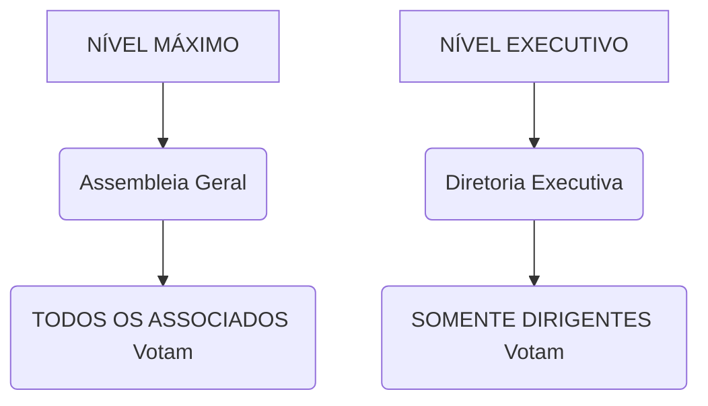
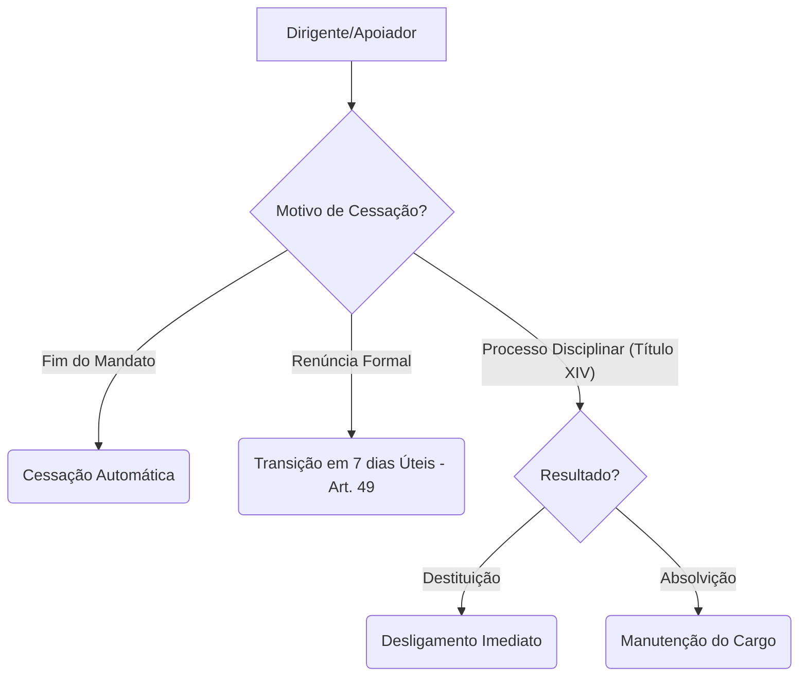

```mermaid
graph TD		
A[Associado Efetivo (Nível 1)] --> B{Quer ser Dirigente ou Apoiador?};
```


```mermaid
B --> C1[Opção: Cargo Eleito (Eleição)];
C1 --> D1{Cumpre Elegibilidade (Art. 46)?};
D1 -- SIM --> E1[Ata de Posse (DE Eleito)];
E1 --> F[Associado Dirigente (Nível 2)];

B --> C2[Opção: Nomeado/Voluntário (Apoio)];
C2 --> D2{Nomeação pela DE / Inscrição Voluntária};
D2 --> E2[Assinatura do Termo de Adesão (Art. 47)];
E2 --> G[Associado Dirigente (Nomeado) ou Apoiador (Nível 3)];

F --> H(VOTA na DE);
G --> I(VOTA na AG / NÃO VOTA na DE);
```

